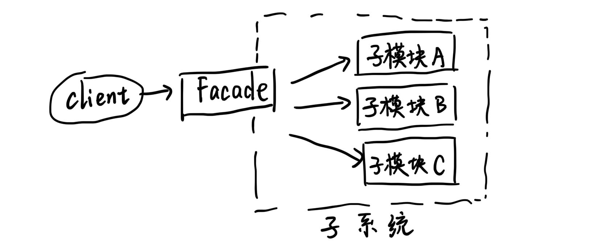

# 外观模式 (Facade)

## 例子

现实生活中，组装计算机，自己买零件组装一台电脑或是买一台已经组装好的整机。不与销售零件的打交道，而是与「装机公司」打交到，给出需求，装机公司直接把组装好的整机返回给我们。

- 卖配件的公司：模块
- 客户端：为了实现某个功能

客户端为了实现某个功能，去自己组合使用模块 or 客户端不用跟系统中的多个模块交互，而且客户端不需要知道那么多模块的细节。

实现 Facade 模式。

## 代码生成器

描述配置的 Model：

```java
public class ConfigModel {
    /** 是否需要生成表现层，默认是 true */
    private boolean needGenPresentation = true;

    /** 是否需要生成逻辑层，默认是 true */
    private boolean needGenBusiness = true;

    /** 是否需要生成 DAO，默认是 true */
    private boolean needGenDAO = true;

    public boolean isNeedGenPresentation() {
        return this.needGenPresentation;
    }
    public boolean setNeedGenPresentation(boolean needGenPresentation) {
        this.needGenPresentation = needGenPresentation;
    }

    public boolean isNeedGenBusiness() {
        return this.needGenBusiness;
    }
    public boolean setNeedGenBusiness(boolean needGenBusiness) {
        this.needGenBusiness = needGenBusiness;
    }
    
    public boolean isNeedGenDAO() {
        return this.needGenDAO;
    }
    public boolean setNeedGenDAO(boolean needGenDAO) {
        this.needGenDAO = needGenDAO;
    }
}
```

配置管理：

```java
public class ConfigManager {
    private static ConfigManager manager = null;
    private static ConfigModel cm = null;
    private ConfigManager() {
        //
    }

    public static ConfigManager getInstance() {
        if (this.manager == null) {
            this.manager = new ConfigManager();
            this.cm = new ConfigModel();

            // 读取配置文件，把值设置到 ConfigModel 中去，这里忽略了
        }

        return this.manager;
    }

    public ConfigModel getConfigData() {
        return cm;
    }
}
```

配置获取后，按照配置来生成代码：

```java
/** 生成表现层模块 */
public class Presentation {
    public void generate() {
        ConfigModel cm = ConfigManager.getInstance().getConfigData();

        if (cm.isNeedGenPresentation()) {
            System.out.println("正在生成表现层代码文件");
        }
    }
}
```

```java
/** 生成逻辑层模块 */
public class Business {
    public void generate() {
        ConfigModel cm = ConfigManager.getInstance().getConfigData();

        if (cm.isNeedGenBusiness()) {
            System.out.println("正在生成逻辑层代码文件");
        }
    }
}
```

```java
/** 生成数据层模块 */
public class DAO {
    public void generate() {
        ConfigModel cm = ConfigManager.getInstance().getConfigData();

        if (cm.isNeedGenDAO()) {
            System.out.println("正在生成数据层代码文件");
        }
    }
}
```

客户端的实现，去掉用多个模块，实现代码文件的生成：

```java
public class Client {
    public static void main(String[] args) {
        // 现在没有配置文件，直接使用默认配置，通常情况下，三层都应该生成
        // 也就是说客户端必须对这些模块都有了解，才能够正常地使用它们。
        new Presentation().generate();
        new Business().generate();
        new DAO().generate();
    }
}
```

运行结果如下：

```
正在生成表现层代码文件
正在生成逻辑层代码文件
正在生成数据层代码文件
```

### 有何问题

- 客户端需要与生成代码「子系统内部」的多个模块交互
- 对客户端而言，是个麻烦
- 「某个模块发生了改变，客户端也要随着变化」

for 子系统外部客户端在使用子系统的时候，既能「简单地」使用这些子系统内部的模块功能，而又不用客户端去与子「系统内部」的「多个模块」交互。

## 外观模式的定义

    为子系统中的「一组接口」提供一个「一致的界面」，Facade 模式定义了一个「高层接口」，这个「接口」使得这一「子系统」更加容易使用。

### 界面

从一个组件的「外部来看」这个组件，能看到什么，就是这个组件的界面，也就是所谓的「外观」。

例如：从一个类的外部来看这个类，public 方法就是这个类的外观。(因为你从这个类的外部看，只能看到这些)

再例如：从一个类的外部看这个模块，这个模块对外部的「接口」就是这个模块的外观，因为你只能看到这些接口，其他的模块内部实现的部分都是被接口「封装隔离」了的。

### 接口

主要指外部和内部「交互的通道」。可以是 interface，但也可以是一个 class 或是 method，并不等价于 (局限于) interface。

## 外观模式结构和说明



1. Facade

定义子系统的多个模块对外的「高层」接口，通常需要调用内部多个模块，从而把客户的请求「代理给」适当的子系统对象。

2. 模块

接受 Facade 对象的「委派」，真正实现功能，各个模块之间可以有交互。

注意：Facade 对象知道各个模块，但模块不应该知道 Facade。

 