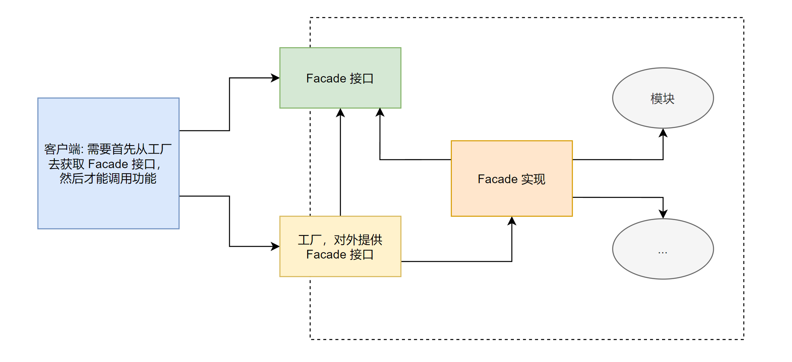

# 外观模式 (Facade)

## 例子

现实生活中，组装计算机，自己买零件组装一台电脑或是买一台已经组装好的整机。不与销售零件的打交道，而是与「装机公司」打交到，给出需求，装机公司直接把组装好的整机返回给我们。

- 卖配件的公司：模块
- 客户端：为了实现某个功能

客户端为了实现某个功能，去自己组合使用模块 or 客户端不用跟系统中的多个模块交互，而且客户端不需要知道那么多模块的细节。

实现 Facade 模式。

## 代码生成器

描述配置的 Model：

```java
public class ConfigModel {
    /** 是否需要生成表现层，默认是 true */
    private boolean needGenPresentation = true;

    /** 是否需要生成逻辑层，默认是 true */
    private boolean needGenBusiness = true;

    /** 是否需要生成 DAO，默认是 true */
    private boolean needGenDAO = true;

    public boolean isNeedGenPresentation() {
        return this.needGenPresentation;
    }
    public boolean setNeedGenPresentation(boolean needGenPresentation) {
        this.needGenPresentation = needGenPresentation;
    }

    public boolean isNeedGenBusiness() {
        return this.needGenBusiness;
    }
    public boolean setNeedGenBusiness(boolean needGenBusiness) {
        this.needGenBusiness = needGenBusiness;
    }
    
    public boolean isNeedGenDAO() {
        return this.needGenDAO;
    }
    public boolean setNeedGenDAO(boolean needGenDAO) {
        this.needGenDAO = needGenDAO;
    }
}
```

配置管理：

```java
public class ConfigManager {
    private static ConfigManager manager = null;
    private static ConfigModel cm = null;
    private ConfigManager() {
        //
    }

    public static ConfigManager getInstance() {
        if (this.manager == null) {
            this.manager = new ConfigManager();
            this.cm = new ConfigModel();

            // 读取配置文件，把值设置到 ConfigModel 中去，这里忽略了
        }

        return this.manager;
    }

    public ConfigModel getConfigData() {
        return cm;
    }
}
```

配置获取后，按照配置来生成代码：

```java
/** 生成表现层模块 */
public class Presentation {
    public void generate() {
        ConfigModel cm = ConfigManager.getInstance().getConfigData();

        if (cm.isNeedGenPresentation()) {
            System.out.println("正在生成表现层代码文件");
        }
    }
}
```

```java
/** 生成逻辑层模块 */
public class Business {
    public void generate() {
        ConfigModel cm = ConfigManager.getInstance().getConfigData();

        if (cm.isNeedGenBusiness()) {
            System.out.println("正在生成逻辑层代码文件");
        }
    }
}
```

```java
/** 生成数据层模块 */
public class DAO {
    public void generate() {
        ConfigModel cm = ConfigManager.getInstance().getConfigData();

        if (cm.isNeedGenDAO()) {
            System.out.println("正在生成数据层代码文件");
        }
    }
}
```

客户端的实现，去掉用多个模块，实现代码文件的生成：

```java
public class Client {
    public static void main(String[] args) {
        // 现在没有配置文件，直接使用默认配置，通常情况下，三层都应该生成
        // 也就是说客户端必须对这些模块都有了解，才能够正常地使用它们。
        new Presentation().generate();
        new Business().generate();
        new DAO().generate();
    }
}
```

运行结果如下：

```
正在生成表现层代码文件
正在生成逻辑层代码文件
正在生成数据层代码文件
```

### 有何问题

- 客户端需要与生成代码「子系统内部」的多个模块交互
- 对客户端而言，是个麻烦
- 「某个模块发生了改变，客户端也要随着变化」

for 子系统外部客户端在使用子系统的时候，既能「简单地」使用这些子系统内部的模块功能，而又不用客户端去与子「系统内部」的「多个模块」交互。

## 外观模式的定义

> 为子系统中的「一组接口」提供一个「一致的界面」，Facade 模式定义了一个「高层接口」，这个「接口」使得这一「子系统」更加容易使用。

### 界面

从一个组件的「外部来看」这个组件，能看到什么，就是这个组件的界面，也就是所谓的「外观」。

例如：从一个类的外部来看这个类，public 方法就是这个类的外观。(因为你从这个类的外部看，只能看到这些)

再例如：从一个类的外部看这个模块，这个模块对外部的「接口」就是这个模块的外观，因为你只能看到这些接口，其他的模块内部实现的部分都是被接口「封装隔离」了的。

### 接口

主要指外部和内部「交互的通道」。可以是 interface，但也可以是一个 class 或是 method，并不等价于 (局限于) interface。

## 外观模式结构和说明


1. Facade

定义子系统的多个模块对外的「高层」接口，通常需要调用内部多个模块，从而把客户的请求「代理给」适当的子系统对象。

2. 模块

接受 Facade 对象的「委派」，真正实现功能，各个模块之间可以有交互。

注意：Facade 对象知道各个模块，但模块不应该知道 Facade。

## 应用外观模式来解决问题的思路

仔细分析上面的问题，客户端想要操作更简单，那就根据客户端的需求来给客户定义一个简单的接口，然后让客户端去调用这个接口，剩下的事情客户端不用管它，这样客户端就变得简单了。

当然，这里所说的接口是客户端和被访问的系统之间的一个通道，并不一定是指 Java 的 interface。在它外观模式里面，通常指的是「类」，这个类被称为「外观」。

外观模式就是通过「引入这么一个外观类」，在这个类里面「定义客户端想要的简单方法」，然后再这些方法的实现里面，由「外观类再去分别调用内部的多个模块」来实现功能，从而让客户端「变得简单」。

这样一来，「客户端就只需要和外观类交互就可以了」。

评论：文中多次强调「让客户端变得简单」。客户端与被访问系统之间通过建立一个桥梁 (通道)，实现解耦合。让客户端能够不管通道「背后」的东西。

## 外观模式示例代码

- 假设子系统内有三个模块，分别是 AModule, BModule 和 CModule
- 它们分别由一个示意的方法

```java
public interface AModuleApi {
    public void testA();
}
```

实现 A 模块的接口：

```java
public class AModuleImpl implements AModuleApi {
    public void testA() {
        System.out.println("现在在 A 模块里操作 testA 方法");
    }
}
```

同理实现 B 模块：

```java
public interface BModuleApi {
    public void testB();
}
```


```java
public class BModuleImpl implements BModuleApi {
    public void testB() {
        System.out.println("现在在 B 模块里操作 testB 方法");
    }
}
```

C 同理，然后定义「外观对象」：

外观对象就是在「被访问系统」与「客户端」之间建立的「通道」。

```java
/**
 * 外观对象
 */
public class Facade {
    /**
     * 示意方法，满足客户需要的功能
     */
    public void test() {
        // 在内部实现的时候，可能会调用到内部多个模块
        AModuleApi a = new AModuleImpl();
        a.testA();
        BModuleApi b = new BModuleImpl();
        b.testB();
        CModuleApi c = new CModuleImpl();
        c.testC();
    }
}
```

客户端：

```java
public class Client {
    public static void main(String[] args) {
        // 使用 Facade
        new Facade().test();
    }
}
```

运行结果如下：

```
现在在A模块里面操作testA方法
现在在B模块里面操作testB方法
现在在C模块里面操作testC方法
```

## 使用外观模式重写代码生成器

新添加一个 Facade 对象：

```java
/**
 * 代码生成子系统的外观对象
 */
public class Facade {
    /**
     * 客户端需要的，一个简单的调用代码生成的功能
     */
    public void generate() {
        new Presentation().generate();
        new Business().generate();
        new DAO().generate();
    }
}
```

其他定义和实现都没有变化，这里就不再赘述。

不再需要客户端去调用子系统内部的多个模块，直接使用外观对象就可以了（变化）。

客户端代码：

```java
public class Client {
    public static void main(String[] args) {
        // 使用 Facade
        new Facade().generate();
    }
}
```

如同上面讲述的例子，Facade 类其实相当于 A、B、C 模块的外观界面，Facade 类也被称为 A、B、C 模块「对外的接口」，有了这个 Facade 类，那么客户端就不需要知道系统内部的实现细节，甚至客户端都不需要知道 A、B、C 模块的存在，客户端只需要跟 Facade 类交互就好了，从而更好地实现了「客户端」和「子系统」中 A、B、C 模块的「解耦」，让客户端更容易地使用系统。

## 模式讲解

### 外观模式的目的

- 外观模式不是给子系统添加新的功能接口，而是为了「让外部减少与子系统内多个模块的交互」，「松散解耦」，从而让「外部」能够「更简单地使用子系统」。
  - 这一点要特别注意，因为外观是当作子系统对外的接口出现的，虽然也可以在这里定义一些「子系统没有的功能」，但不建议这样做。
  - 外观应该是「包装已有的功能」，它主要负责「组合已有功能来实现客户需要，而不是添加新功能」。

### 使用外观和不适用外观相比有什么变化

有人说：外观模式不就是把原来在客户端的代码搬到 Facade 里面了吗？没什么大变化呀？

没错，确实如此，表面上看是把客户端的代码搬到 Facade 里面了，但「实质上」发生了变化。

- 思考：Facade 到底位于何处，是位于客户端还是由A、B、C模块组成的系统这边？
- 答案：肯定在系统这边，这有什么不一样吗？

不一样：如果 Facade 在系统这边，那么就相当于屏蔽了「外部客户端」和「系统内部模块」的交互，从而把 A、B、C 模块组合成为一个「整体」对外，不但「1. 方便了客户端的调用」，而且「2. 封装了系统内部的细节功能」。

也就是说，Facade 与各个模块交互的过程已经是内部实现了。这样一来，如果今后调用模块的算法发生了变化，比如变化成要先调用 B，然后调用 A，那么「只需要」修改 Facade 的实现就可以了。

另外一个好处：Facade 的功能可以被很多个客户端调用，也就是说 Facade 可以实现「功能的共享」，也就是「实现复用」。同样的调用代码就只用在 Facade 里面写一次就好了，而不用在多个调用的地方重复写。

还有一个潜在的好处：对使用 Facade 的人员来说，Facade 大大节省了他们学习成本，他们只需要了解 Facade 即可，无须再深入到子系统内部，去了解每个模块的细节，也不用和多个模块交互，从而使得开发简单，学习也容易。

### 有外观可以不使用

虽然有了外观，但如果有需要，外部还是可以直接「绕开 Facade」，而直接调用某个具体模块的接口，这样就能实现兼顾组合功能和细节功能。

比如在客户端就想要使用 A 模块的功能，那么就不需要使用 Facade，可以直接调用 A 模块的接口。

示例代码：

```java
public class Client {
    public static void main(String[] args) {
        AModule a = new AModuleImpl();
        a.testA(); // 直接调用
    }
}
```

### 外观提供了缺省功能实现

很多子系统，客户端不想和子系统多个模块进行交互，因为麻烦和复杂。

外观对象可以为用户提供一个简单的、缺省的实现，这个实现对大多数的用户来说都是已经足够了的。但是外观「并不限制」那些「需要更多定制功能」的用户，可以「直接越过外观」去访问内部模块的功能。

### 外观模式的实现

1. Facade 的实现

对于一个子系统而言，外观模式不需要很多，通常可以实现成一个单例。

也可以直接把外观中的方法实现成「静态的方法」，这样就可以「不需要创建外观对象的实例」而直接调用，这种实现相当于把「外观类」当成一个「辅助工具」类实现。

```java
public class Facade {
    private Facade() { }
    public static void test() {
        AModuleApi a = new AModuleImpl();
        a.testA();
        BModuleApi b = new BModuleImpl();
        b.testB();
        CModuleApi c = new CModuleImpl();
        c.testC();
    }
}
```

2. Facade 可以实现成为 interface

虽然 Facade 通常直接实现成为类，但是也可以把 Facade 实现成为真正的 interface。

只是这样会增加系统的复杂程度，因为这样会需要一个 Facade 的实现，还需要一个「来获取 Facade 接口对象的工厂」。



3. Facade 实现为 interface 的附带好处

如果把 Facade 实现成为接口，还附带一个功能，就是能够「有选择性地暴露」接口的方法，尽量减少「模块对子系统外」提供的接口方法。

> 换句话说，一个模块的「接口中定义」的方法可以分成两部分，一部分是给予系统「外部使用」的，一部分是「子系统内部的模块」间相互调用使用的。有了 Facade 接口，那么用于子系统「内部的接口功能」就「不用暴露给子系统」的「外部」了。

「P42 未完待续...」

4. Facade 的方法实现

- Facade 的方法实现中，一般是负责把「客户端的请求」转发给「子系统内部」的各个模块进行处理。
- Facade 的方法实现只是一个功能的「组合调用」。

当然，在 Facade 中实现一个逻辑处理也并不是不可以，但「不建议」这样做，因为这「不是 Facade 的本意」，也超出了 Facade 的边界。

### 外观模式的优缺点

外观模式有如下优点：

- 松散解耦
  外观模式「松散了」客户端与子系统的「耦合关系」，让子系统内部的模块能够更容易「扩展」和「维护」。
- 简单易用
  外观模式让子系统更加「易用」，客户端「不再需要了解」系统内部的实现，也不需要跟众多子系统内部的模块进行交互，只需要「跟外观交互」就可以了，相当于外观类为外部客户端使用子系统「提供了一站式服务」。
- 更好地划分访问层次
  通过合理使用 Facade，可以帮助我们更好地「划分访问的层次」。有些方法是对系统外的，有些方法是对系统内部使用的。把需要暴露给系统外部的功能集中到「外观」中，这样既方便客户端使用，也很好地「隐藏了内部的细节」。

缺点：

过多的或是不太合理的 Facade 也容易让人迷惑。到底是用 Facade 好呢，还是直接调用模块好。(选择困难综合征)

## 思考外观模式

1. 外观模式的本质

  封装实现，简化调用。

Facade 封装了子系统「外部」和子系统「内部」多个模块的交互过程，从而简化了「外部」的调用。通过外观，子系统为外观提供了一些「高层接口」，以便它们的使用。

2. 对「设计原则」的体现

外观模式很好地体现了「最少知识原则」。

如果不使用外观模式，客户端通常需要和子系统内部的「多个模块交互」，也就是说客户端会有「很多的朋友」，客户端和这些模块之间有「依赖关系」，任何一个模块的「变动」都可能会引起客户端的变动。

使用外观模式后，客户端「只需要」和外观类交互，也就是说客户端「只有外观这一个朋友」，客户端就不需要去关心子系统内部的变动情况了，客户端「只是和这个外观类有依赖关系」。

这样一来，客户端不但简单，而且这个系统会「更有弹性」。当系统内部多个模块发生变化的时候，这个变化可以被这个外观类「吸收和消化」(外观这个朋友，一个人把事情抗着，无论外观那边 (内部) 事情多复杂，多糟糕；反正客户端不用管，外观来承担)，并不影响到客户端，换句话说就是：可以在「不影响客户端的情况下，实现系统内部的维护和扩展」。

3. 何时选用外观模式

建议在以下情况下选择外观模式：

- 如果希望一个「复杂的子系统」提供一个「简单接口」的时候，可以考虑使用外观模式。使用「外观对象」来实现大部分客户端需要的功能，从而「简化」客户端的使用。
- 如果想要让「客户端程序」和「抽象类」的实现部分「松散解耦」，可以考虑使用外观模式，使用外观对象来将这个系统与它的客户端分离开来，从而提高子系统的「独立性」和「可移植性」。
- 如果构建「多层结构」的系统，可以考虑使用外观模式，使用外观对象作为每层的入口，这样可以「简化层间调用」，也可以「松散」层次之间的「依赖关系」。

## 相关模式

### 外观模式和中介者模式

这两个模式非常类似，但却有本质的区别。

- **中介者模式主要用来封装多个对象之间相互的交互**，多用于在系统内部的多个模块之间；而外观模式封装的是单向的交互，是从客户端访问系统的调用，没用从系统中访问客户端的调用。(一个是双向，一个是单向交互)。
- **在中介者模式的实现里面**，是需要实现具体的交互功能的；而外观模式的实现里面，一般是组合调用或是转调内部实现的功能，通常外观模式本身并不实现这些功能。(一个需要主动实现交互功能，一个是被动的，被动根据已实现的模块功能进行 Facade 类的编写)
- **中介者模式的目的主要是松散多个模块之间的解耦**，把这些耦合关系全部放到中介者中去实现；而外观模式的目的是简化客户端的调用，这点和中介者模式也不同。(一个是将耦合关系交给中间人、中介者来做，一个是简化客户端的调用)

### 外观模式和单例模式

- 通常一个子系统只需要一个外观实例，所以外观模式也可以和单例模式「组合使用」，把 Facade **类实现成为单例**。当然，也可以跟前面示例的那样，把外观模类构造方法私有化，然后把提供给客户端的方法实现成为静态的。(两者组合使用)

### 外观模式和抽象工厂模式

外观模式的外观通常需要和系统内部的多个模块交互，每个模块一般都有自己的接口，**所以在外观类的实现里面**，需要获取这些接口，然后组合这些接口来完成客户端的功能。` 

那么怎么获取这些接口呢？就可以和抽象工厂一起使用，外观类通过抽象工厂来获取所需要的接口，而抽象工厂也可以把模块内部的实现对 Facade 进行屏蔽，也就是说 Facade 也仅仅只是知道它从模块中获取它需要的功能，模块内部的细节，Facade 也不知道。
