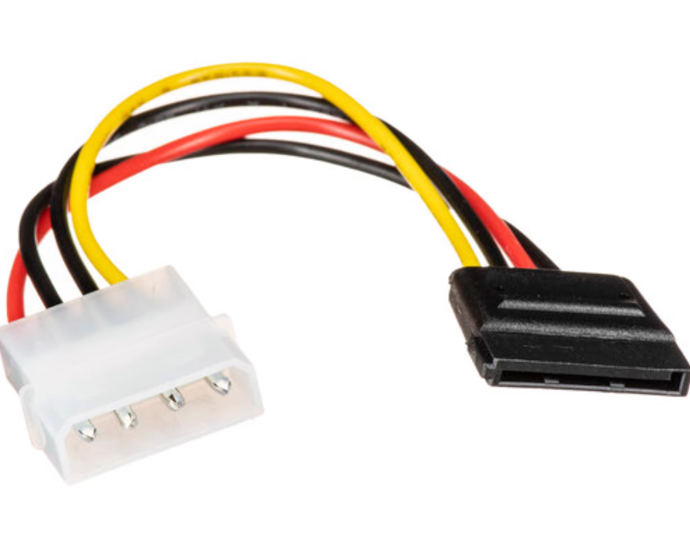
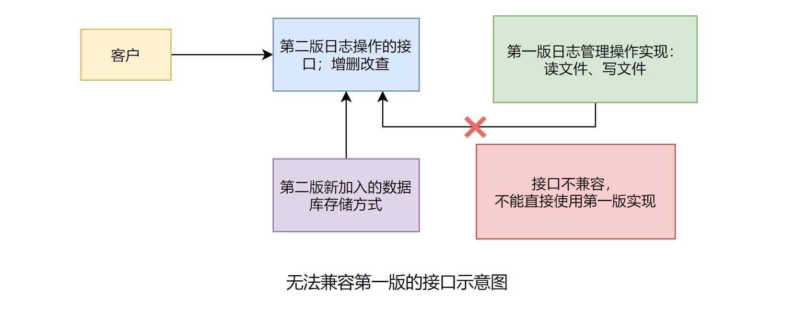
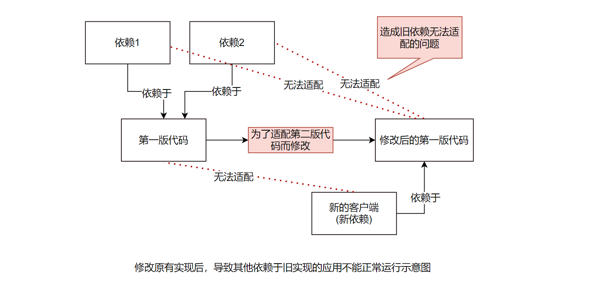
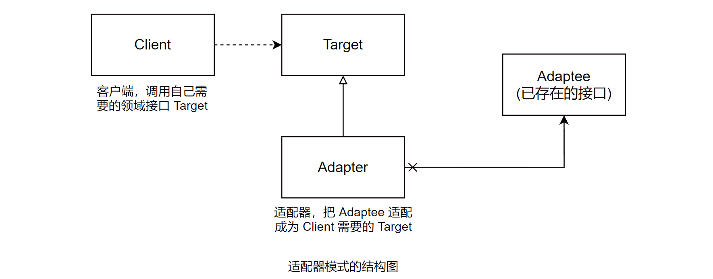

## 适配器模式 (Adapter)

## 场景问题

### 电脑装机的例子

给电脑加个新的硬盘，电脑电源没有剩余的 SATA 供电线了，怎么办？可以使用「转接线」，大 4PIN 供电转 SATA。



把原有的接口转换来适应新需要的接口，实现一个「转接线类」 —— 适配器 (Adapter)。

### 同时支持「数据库」和「文件」的日志管理

还有生活中很多例子，例如各种管道的「转接头」，不同制式的「插座」等，能帮助理解适配器模式，但还是和应用系统开发有一定差距。

感觉好像很轻松就理解了，但开发的时候就不知道如何使用这个模式了，有些「隔靴搔痒」的感觉。

通过以下开发中的例子，进一步认识适配器模式：

用户对日志记录的要求很高，有些时候不得不自己写一个日志工具或日志框架来满足特定需求。

#### 1. 日志管理第一版

在第一版的时候，用户要求日志以「文件」的形式记录。开发人员遵循用户的要求，对日志文件的存取实现如下。

(1) 首先需要简单定义日志对象，也就是描述日志的对象模型。由于这个对象需要被写入文件中，因此这个对象需要「序列化」。示例代码如下：

```java
/**
 * 日志数据对象
 */
public class LogModel {
    /* 日志编号 */
    private String logId;

    /* 操作人员 */
    private String operateUser;

    /* 操作时间 */
    private String operateTime;

    /* 操作内容 */
    private String logContent;

    public String getLogId() {
        return logId;
    }

    public void setLogId(String logId) {
        this.logId = logId;
    }

    // 各种 getter/setter....
    // ...

    public String toString() {
        return "logId="+logId+",operateUser="+operateUser+",operateTime="+operateTime+",logContent="+logContent;
    }
}
```

(2) 接下来定义一个操作日志文件的接口：

```java
/**
 * 日志文件操作接口
 */
public interface LogFileOperateApi {
    /**
     * 读取日志文件，从文件里面获取日志文件列表对象
     * @return 存储日志列表对象
     */
    public List<LogModel> readLogFile();

    /**
     * 写日志文件，把日志列表写出到日志文件中去
     * @param list 要写到日志文件的日志列表
     */
    public void writeLogFile(List<LogModel> list);
}
```

(3) 实现日志文件的存取。现在的实现也很简单，就是读写文件：

```java
/**
 * 实现对日志文件的操作
 */
public class LogFileOperate implements LogFileOperateApi {
  /**
   * 日志文件的路径和文件名称，默认是当前项目根目录下的 AdapterLog.log
   */
  private String logFilePathName = "AdapterLog.log";

  /**
   * 构造方法，传入文件的路径和名称
   */
  public LogFileOperate(String logFilePathName) {
      // 先判断是否传入了文件的路径和名称，如果是，
      // 就重新设置操作的日志文件的路径和名称
      if (logFilePathName != null && logFilePathName.trim().length() > 0) {
          this.logFilePathName = logFilePathName;
      }
  }

  public List<LogModel> readLogFile() {
      List<LogModel> list = null;
      ObjectInputStream oin = null;
      try {
          File f = new File(logFilePathName);
          if (f.exist()) {
              oin = new ObjectInputStream(
                  new BufferedInputStream(
                      new FileInputStream(f)
                  )
              )
              list = (List<LogModel>)oin.readObject();
          }
      } catch (Exception e) {
          e.printStackTrace();
      } finally {
          try {
              if (oin != null) {
                  oin.clone();
              }
          } catch (IOException e) {
              e.printStackTrace();
          }
      }
      
      return list;
  }

  public void writeLogFile(List<LogModel> list) {
      File f = new File(logFileName);
      ObjectOutputStream oout = null;
      try {
          oout = new ObjectOutputStream(
              new BufferedOutputStream(
                  new FileOutputStream(f)
              )
          );

          oout.writeObject(null);
      } catch (IOException e) {
          e.printStackTrace();
      } finally {
          try {
              oout.clone();
          } catch (IOException e) {
              e.printStackTrace();
          }
      }
  }
}
```

(4) 写个客户端来测试以下，看看好用不。

```java
public class Client {
    public static void main(String[] args) {
        // 准备日志内容，也就是测试的数据
        LogModel lml = new LogModel();
        lml.setLogId("001");
        lml.setOperateUser("admin");
        lml.setOperateTime("2021-03-02 10:08:18");
        lml.setLogContent("这是一个测试");

        List<LogModel> list = new ArrayList<LogModel>();
        list.add(lml);

        // 创建操作日志文件的对象
        LogFileOperateApi api = new LogFileOperate("");

        // 保存日志文件
        api.writeLogFile(list);

        // 读取日志文件内容
        List<LogModel> readLog = api.readLogFile();
        System.out.println("readLog="+readLog);
    }
}
```
测试的结果如下：

```
readLog=[logId=001,operateUser=admin,operateTime=2010-03-02]
10:08:18,logContent=这是一个测试]
```

至此简单的实现了用户的要求，把日志文件「保存到文件中」，并且「从文件把日志内容读取出来」，进行管理。

看上去很容易，对吧，别慌，接着来。

#### 2. 日志管理第二版

用户使用日志管理第一版一段时间后，开始考虑升级系统 (加需求)。

决定采用「数据库」来管理日志。

很快，按照数据库日志管理也实现出来了，并定义了日志管理的操作接口，主要是正对日志的增删改查的方法。接口的示例代码如下：

```java
/**
 * 定义操作日志的应用接口，为了示例的简单，只是简单地定义了增删改查的方法
 */
public interface LogDbOperateApi {
    /**
     * 新增日志
     * @param lm 需要新增的日志对象
     */
    public void createLog(LogModel lm);

    /**
     * 修改日志
     * @param lm 需要修改的日志对象
     */
    public void updateLog(LogModel lm);

    /**
     * 删除日志
     * @param lm 需要删除的日志对象
     */
    public void updateLog(LogModel lm);

    /**
     * 删除日志
     * @param lm 需要删除的日志对象
     */
    public void removeLog(LogModel lm);

    /**
     * 获取所有的日志
     * @param 所有日志对象
     */
    public List<LogModel> getAllLog();
}
```

对于使用数据库来保存日志的实现，这里就不去涉及了，总之知道有这么一个「实现」就可以了。

客户提出了新的要求，能不能让日志管理第二版实现「同时」支持「数据库存储」和「文件存储」两种方式？

## 有何问题

有朋友可能回想，这有什么困难呢，两种实现方式不都是已经实现了吗，合并起来不就可以了？

问题在于，现在的业务是「使用的第二版的接口」，直接使用第二版新加入的实现是没有问题的，第二版新加入了「保存日志到数据库」中；但是「对于已有」的实现方法，也就是在第一版中采取的存储方式，它的操作接口和第二版「不一样」，这就导致了现在客户端「无法以同样的方式」来直接使用第一版的实现。如图：



这就意味着，想要同时支持文件和数据库存储两种方式，需要「额外」地做一些工作，才可以让第一版的实现适应新的业务需要。

有朋友可能会想，干脆按照第二版的接口要求来「重新实现一个」文件操作的对象不久可以了吗，这样做确实可以，但是何必要重新做已经完成的功能呢？应该想办法复用，而不是重新实现。

一种很容易想到的方式是「直接修改已有的第一版代码」。但这种方式是不太好的，如果直接修改第一版的代码，那么久可能会导致「其他依赖于这些实现的应用不能正常运行」，再说，有可能第一版和第二版的开发公司是不一样的，在第二版实现的时候，根本拿不到第一版的源代码。



## 解决方案

### 使用适配器模式来解决问题

用来解决上述问题的一个合理的解决方案就是适配器模式。那么什么是适配器模式呢？

#### 1. 适配器模式的定义

> 将一个类的接口「转换成」客户端希望的「另一个接口」。适配器模式使得原本由于接口不兼容而能一起工作的那些类可以一起使用。

(想到了 office 2007 兼容包，让旧版 office 能打开新的 .docx 文件；适配器也可以说是转化器吧)

#### 2. 应用适配器模式来解决问题的思路

仔细分析上面的问题，问题的根源在于「接口的不兼容」，功能是基本实现了的，也就是说，只要想办法「让两边的接口匹配起来」，就可以复用第一版的功能了。

按照适配器模式的实现方法，可以「定义一个类」来实现第二版的功能，然后再内部实现的时候，「转调第一版已经实现了的功能」，这样就可以通过对象组合的方式，既「复用了第一版已有的功能」，同时「又在接口上满足了第二版」调用的要求。

### 适配器模式的结构和说明



- Client: 客户端，调用自己需要领域接口 Target。
- Target: 定义「客户端需要的」特定领域的「接口」。
- Adaptee: 「已存在的接口」，通常能满足客户端的功能需求，但是「接口与客户端要求的」特定领域的「接口不一致」，需要「被适配」。
- Adapter: 适配器，把 Adaptee 适配成为 Client 需要的 Target。

### 适配器模式示例代码

