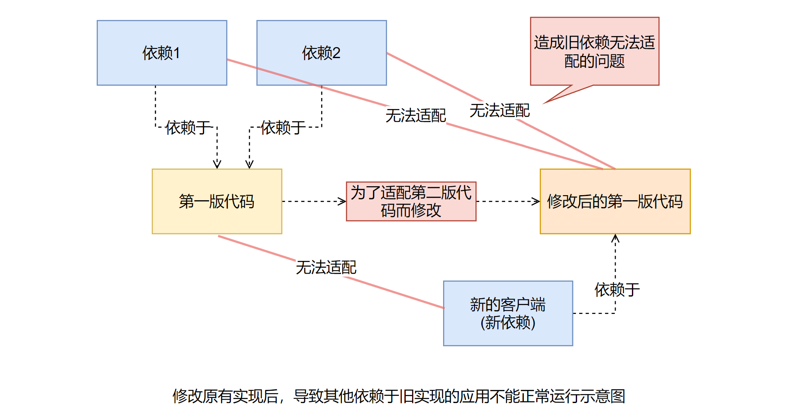
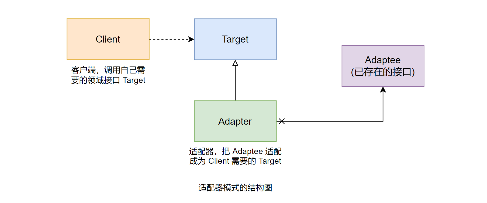
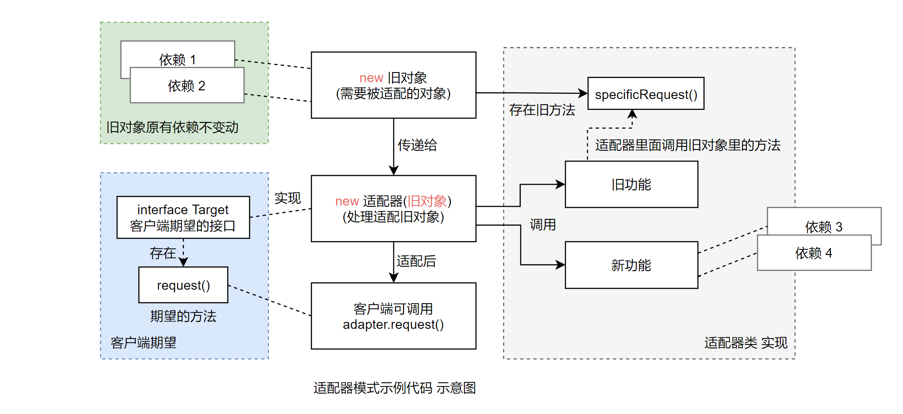

# 适配器模式 (Adapter)

## 场景问题

### 电脑装机的例子

给电脑加个新的硬盘，电脑电源没有剩余的 SATA 供电线了，怎么办？可以使用「转接线」，大 4PIN 供电转 SATA。


把原有的接口转换来适应新需要的接口，实现一个「转接线类」 —— 适配器 (Adapter)。

### 同时支持「数据库」和「文件」的日志管理

还有生活中很多例子，例如各种管道的「转接头」，不同制式的「插座」等，能帮助理解适配器模式，但还是和应用系统开发有一定差距。

感觉好像很轻松就理解了，但开发的时候就不知道如何使用这个模式了，有些「隔靴搔痒」的感觉。

通过以下开发中的例子，进一步认识适配器模式：

用户对日志记录的要求很高，有些时候不得不自己写一个日志工具或日志框架来满足特定需求。

#### 1. 日志管理第一版

在第一版的时候，用户要求日志以「文件」的形式记录。开发人员遵循用户的要求，对日志文件的存取实现如下。

(1) 首先需要简单定义日志对象，也就是描述日志的对象模型。由于这个对象需要被写入文件中，因此这个对象需要「序列化」。示例代码如下：

```java
/**
 * 日志数据对象
 */
public class LogModel {
    /* 日志编号 */
    private String logId;

    /* 操作人员 */
    private String operateUser;

    /* 操作时间 */
    private String operateTime;

    /* 操作内容 */
    private String logContent;

    public String getLogId() {
        return logId;
    }

    public void setLogId(String logId) {
        this.logId = logId;
    }

    // 各种 getter/setter....
    // ...

    public String toString() {
        return "logId="+logId+",operateUser="+operateUser+",operateTime="+operateTime+",logContent="+logContent;
    }
}
```

(2) 接下来定义一个操作日志文件的接口：

```java
/**
 * 日志文件操作接口
 */
public interface LogFileOperateApi {
    /**
     * 读取日志文件，从文件里面获取日志文件列表对象
     * @return 存储日志列表对象
     */
    public List<LogModel> readLogFile();

    /**
     * 写日志文件，把日志列表写出到日志文件中去
     * @param list 要写到日志文件的日志列表
     */
    public void writeLogFile(List<LogModel> list);
}
```

(3) 实现日志文件的存取。现在的实现也很简单，就是读写文件：

```java
/**
 * 实现对日志文件的操作
 */
public class LogFileOperate implements LogFileOperateApi {
  /**
   * 日志文件的路径和文件名称，默认是当前项目根目录下的 AdapterLog.log
   */
  private String logFilePathName = "AdapterLog.log";

  /**
   * 构造方法，传入文件的路径和名称
   */
  public LogFileOperate(String logFilePathName) {
      // 先判断是否传入了文件的路径和名称，如果是，
      // 就重新设置操作的日志文件的路径和名称
      if (logFilePathName != null && logFilePathName.trim().length() > 0) {
          this.logFilePathName = logFilePathName;
      }
  }

  public List<LogModel> readLogFile() {
      List<LogModel> list = null;
      ObjectInputStream oin = null;
      try {
          File f = new File(logFilePathName);
          if (f.exist()) {
              oin = new ObjectInputStream(
                  new BufferedInputStream(
                      new FileInputStream(f)
                  )
              )
              list = (List<LogModel>)oin.readObject();
          }
      } catch (Exception e) {
          e.printStackTrace();
      } finally {
          try {
              if (oin != null) {
                  oin.clone();
              }
          } catch (IOException e) {
              e.printStackTrace();
          }
      }
      
      return list;
  }

  public void writeLogFile(List<LogModel> list) {
      File f = new File(logFileName);
      ObjectOutputStream oout = null;
      try {
          oout = new ObjectOutputStream(
              new BufferedOutputStream(
                  new FileOutputStream(f)
              )
          );

          oout.writeObject(null);
      } catch (IOException e) {
          e.printStackTrace();
      } finally {
          try {
              oout.clone();
          } catch (IOException e) {
              e.printStackTrace();
          }
      }
  }
}
```

(4) 写个客户端来测试以下，看看好用不。

```java
public class Client {
    public static void main(String[] args) {
        // 准备日志内容，也就是测试的数据
        LogModel lml = new LogModel();
        lml.setLogId("001");
        lml.setOperateUser("admin");
        lml.setOperateTime("2021-03-02 10:08:18");
        lml.setLogContent("这是一个测试");

        List<LogModel> list = new ArrayList<LogModel>();
        list.add(lml);

        // 创建操作日志文件的对象
        LogFileOperateApi api = new LogFileOperate("");

        // 保存日志文件
        api.writeLogFile(list);

        // 读取日志文件内容
        List<LogModel> readLog = api.readLogFile();
        System.out.println("readLog="+readLog);
    }
}
```
测试的结果如下：

```
readLog=[logId=001,operateUser=admin,operateTime=2010-03-02]
10:08:18,logContent=这是一个测试]
```

至此简单的实现了用户的要求，把日志文件「保存到文件中」，并且「从文件把日志内容读取出来」，进行管理。

看上去很容易，对吧，别慌，接着来。

#### 2. 日志管理第二版

用户使用日志管理第一版一段时间后，开始考虑升级系统 (加需求)。

决定采用「数据库」来管理日志。

很快，按照数据库日志管理也实现出来了，并定义了日志管理的操作接口，主要是正对日志的增删改查的方法。接口的示例代码如下：

```java
/**
 * 定义操作日志的应用接口，为了示例的简单，只是简单地定义了增删改查的方法
 */
public interface LogDbOperateApi {
    /**
     * 新增日志
     * @param lm 需要新增的日志对象
     */
    public void createLog(LogModel lm);

    /**
     * 修改日志
     * @param lm 需要修改的日志对象
     */
    public void updateLog(LogModel lm);

    /**
     * 删除日志
     * @param lm 需要删除的日志对象
     */
    public void updateLog(LogModel lm);

    /**
     * 删除日志
     * @param lm 需要删除的日志对象
     */
    public void removeLog(LogModel lm);

    /**
     * 获取所有的日志
     * @param 所有日志对象
     */
    public List<LogModel> getAllLog();
}
```

对于使用数据库来保存日志的实现，这里就不去涉及了，总之知道有这么一个「实现」就可以了。

客户提出了新的要求，能不能让日志管理第二版实现「同时」支持「数据库存储」和「文件存储」两种方式？

## 有何问题

有朋友可能回想，这有什么困难呢，两种实现方式不都是已经实现了吗，合并起来不就可以了？

问题在于，现在的业务是「使用的第二版的接口」，直接使用第二版新加入的实现是没有问题的，第二版新加入了「保存日志到数据库」中；但是「对于已有」的实现方法，也就是在第一版中采取的存储方式，它的操作接口和第二版「不一样」，这就导致了现在客户端「无法以同样的方式」来直接使用第一版的实现。如图：


这就意味着，想要同时支持文件和数据库存储两种方式，需要「额外」地做一些工作，才可以让第一版的实现适应新的业务需要。

有朋友可能会想，干脆按照第二版的接口要求来「重新实现一个」文件操作的对象不久可以了吗，这样做确实可以，但是何必要重新做已经完成的功能呢？应该想办法复用，而不是重新实现。

一种很容易想到的方式是「直接修改已有的第一版代码」。但这种方式是不太好的，如果直接修改第一版的代码，那么久可能会导致「其他依赖于这些实现的应用不能正常运行」，再说，有可能第一版和第二版的开发公司是不一样的，在第二版实现的时候，根本拿不到第一版的源代码。



## 解决方案

### 使用适配器模式来解决问题

用来解决上述问题的一个合理的解决方案就是适配器模式。那么什么是适配器模式呢？

#### 1. 适配器模式的定义

> 将一个类的接口「转换成」客户端「希望」的「另一个接口」。
> 
> 适配器模式使得原本由于「接口不兼容」而「不能一起」工作的那些类「可以一起」使用。

(想到了 office 2007 兼容包，让旧版 office 能打开新的 .docx 文件；适配器也可以说是转化器吧)

#### 2. 应用适配器模式来解决问题的思路

仔细分析上面的问题，问题的根源在于「接口的不兼容」，功能是基本实现了的。

也就是说，只要想办法「让两边的接口匹配起来」，就可以复用第一版的功能了。

按照适配器模式的实现方法，可以「定义一个类」来实现第二版的功能，然后再内部实现的时候，「转调第一版已经实现了的功能」，这样就可以通过「对象组合」的方式，既「复用了第一版已有的功能」，同时「又在接口上满足了第二版」调用的要求。

### 适配器模式的结构和说明



- Client: 客户端，调用自己需要领域接口 Target。
- Target: 定义「客户端需要的」特定领域的「接口」。
- Adaptee: 「已存在的接口」，通常能满足客户端的功能需求，但是「接口与客户端要求的」特定领域的「接口不一致」，需要「被适配」。
- Adapter: 适配器，把 Adaptee 适配成为 Client 需要的 Target。

### 适配器模式示例代码

(1) 先看看 Target 接口定义的示例代码如下：

```java
/**
 * 定义「客户端」使用的接口，与「特定领域」相关
 */
public interface Target {
    /**
     * 示意方法，客户端请求处理方法
     */
    public void request();
}
```

(2) 再看看需要被适配的对象定义。示例代码如下：

```java
/**
 * 已存在的接口，这个接口需要「被适配」
 */
public class Adaptee {
    /**
     * 示意方法，原本已经存在，已经实现的方法
     */
    public void specificRequest() {
        // 具体功能的处理
    }
}
```

(3) 下面是适配器对象的基本方法。示例代码如下：

```java
/**
 * 适配器
 */
public class Adapter implements Target {
    /**
     * 持有需要被适配的接口对象
     */
    private Adaptee adaptee;

    /**
     * 构造方法，传入需要被适配的对象
     * @param adaptee 需要被适配的对象
     */
    public Adapter(Adaptee adaptee) {
        this.adaptee = adaptee;
    }

    public void request() { // ← 这个 request 方法就是用户期望调用的 (Target 接口中的定义)
        // 可以转调已经实现了的方法，进行适配
        adaptee.specificRequest();
    }
}
```

(4) 再来看看使用适配器的示例代码如下：

```java
/**
 * 使用适配器的客户端
 */
public class Client {
    public static void main(String[] args) {
        // 创建需要被适配的对象
        Adaptee adaptee = new Adaptee();

        // ↑ 实例化旧的类，也就是需要被适配的对象
        // 然后拿给 Adapter 把旧的适配成新
        // (客户端期望的，也就是 Target 接口定义的)
        //
        // 突然想到了浏览器的 polyfill，似乎有点像？ 

        // 创建客户端期望的接口对象
        Target target = new Adapter(adaptee); // ← 把旧的对象拿给 Adapter 处理

        // 请求处理
        target.request();
    }
}
```



### 使用适配器模式来实现示例

使用适配器模式来实现示例，关键是要「实现适配器对象」。

它需要第二版的接口，但是在「内部」实现的时候，需要「调用」第一版「已经实现的功能」。

也就是说：
- 第二版的「接口」就相当于适配器模式中的「Target 接口」，(注：`class Adapter implements Target`)
- 而第一版已有的实现就「相当于」是适配器模式中的「Adaptee」对象。

(1) 把适配器简单的实现出来，示意一下。示例代码如下：

```java
/**
 * 适配器对象，将记录日志「到文件」的功能「适配成」第二版需要的增删改查功能
 */
public class Adapter implements LogDbOperateApi {
    /**
     * 持有需要被适配的对象
     */
    private LogFileOperateApi adaptee;

    /**
     * 构造方法，传入需要被适配的对象
     * @param adaptee 需要被适配的对象
     */
    public Adapter(LogFileOperateApi adaptee) {
        this.adaptee = adaptee;
    }

    public void createLog(LogModel lm) {
        // 1: 先读取文件的内容
        List<LogModel> list = adaptee.readLogFile();
        
        // 2: 加入新的日志对象
        list.add(lm);

        // 3: 重新写入文件
        adaptee.writeLogFile(list);
    }

    public List<LogModel> getAllLog() {
        return adaptee.readLogFile();
    }

    public void removeLog(LogModel lm) {
        // 1: 先读取文件内容
        List<LogModel> list = adaptee.readLogFile();

        // 2: 删除相应的日志对象
        list.remove(lm);

        // 3: 重新写入文件
        adaptee.writeLogFile(list);
    }

    public void updateLog(LogModel lm) {
        // 1: 先读取文件的内容
        List<LogModel> list = adaptee.readLogFile();

        // 2: 修改相应的日志对象
        for (int i = 0; i < list.size(); i++) {
            if (list.get(i).getLogId().equals(lm.getLogId())) {
                list.set(i, lm);
                break;
            }
        }

        // 3: 重新写入文件
        adaptee.writeLogFile(list);
    }
}
```

(2) 此时的「客户端也需要一些改变」。示例代码如下：

```java
public class Client {
    public static void main(String[] args) {
        // 准备日志内容，也就是测试的数据
        LogModel lml = new LogModel();
        lml.setLogId("001");
        lml.setOperateUser("admin");
        lml.setOperateTime("2022-03-09 15:22:00");
        lml.setLogContent("好耶！");
        List<LogModel> list = new ArrayList<LogModel>();
        list.add(lml);

        // 创建操作日志文件的对象
        LogFileOperateApi logFileApi = new LogFileOperate("");

        // 创建新版操作日志的接口对象
        LogDbOperate api = new Adapter(logFileOperateApi);

        // 保存日志文件
        api.createLog(lml);

        // 读取日志文件的内容
        List<LogModel> allLog = api.getAllLog();
        System.out.println("allLog="+allLog);
    }
}
```

运行上述代码，测试是否满足要求。

评论：

- 适配器模式，达到的效果是 interface 之间的“无缝”转换，客户端可以使用新的功能，像以前的方式一样调用。
- 使用适配器模式，客户端也需要一些改变。

[P60] 一些总结的图示

转到：[适配器模式 (下)](./3_适配器模式_2.md)