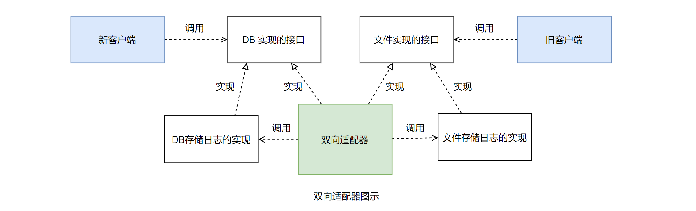
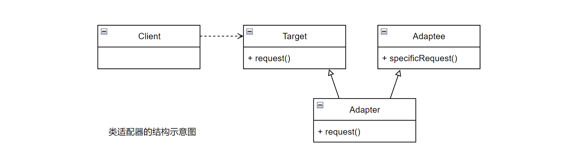
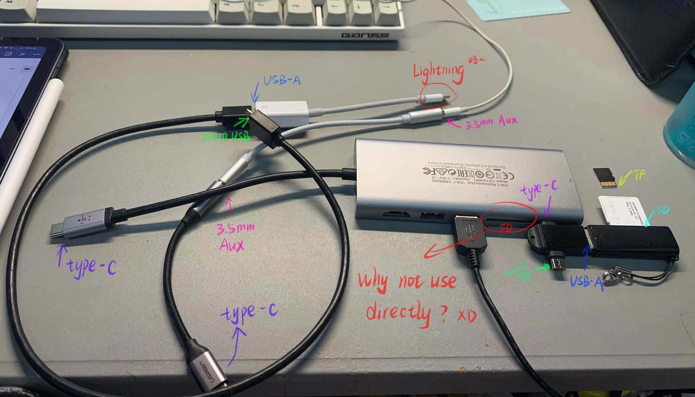

## 模式讲解

### 认识适配器模式

#### 1. 模式的功能

- 适配器模式的主要功能是「转换匹配」，目标是「复用已有的功能」，而不是实现新的接口。
- 也就是说，客户端需要的功能应该是「已经实现好了的」，「不需要」适配器模式来实现。
- 适配器模式主要负责把「不兼容的接口转换成客户端期望的样子」就可以了。

但这并不是说：在适配器里面就不能实现功能。适配器「可以实现功能」，称这种适配器为「智能适配器」。

再说了，在「接口匹配」和「转换」的过程中，也有「需要额外实现一些特定的功能」，才能够转换过来，比如需要调用参数以进行匹配等。

#### 2. Adaptee 和 Target 的关系

适配器模式中，被适配的接口 Adaptee 和 适配成为的接口 Target 是「没有关系的」，也就是说，Adaptee 和 Target 中的「方法既可以相同，也可以不同」。

极端情况下两个接口里面的方法可能是「完全不同」的，但也可以是「完全相同」的。

这里所说的「相同和不同」，是指方法定义的「名称、参数列表、返回值」，以及「本身的功能」都可以相同或不同。

#### 3. 对象组合

根据前面的实现，你会发现，适配器的实现方式其实是依靠「对象组合」的方式。

通过给适配器对象「组合被适配的对象」，然后当客户端调用 Target 的时候，适配器会把相应的功能「委托给被适配的对象去完成」。

#### 4. 适配器模式的调用顺序示意图

[P61]

评论：

- 适配器的主要功能是：转换匹配。
- 目的是：转换「已经实现」的功能，让客户端能够用「以前原来的方式」，调用到「被适配对象 (Adaptee)」。
- 这个客户端期望的方式 (以前的方式 Target)，原本就存在，而不是适配器 (Adapter) 新定义的。
- Adaptee 和 Target 是「没有关系」的，两个 interface 可以完全相同，可以完全不同。
- Adapter 的功能就是将 Adaptee 适配成 Target 接口的样子，实现「转换匹配」。

### 适配器模式的实现

#### 1. 适配器的常见实现

- 在实现适配器的时候，适配器通常是「一个类」，一般会让适配器类「去实现 Target 接口」，
- 然后在适配器的具体实现里面调用 Adaptee。
  - 也就是说适配器通常是一个 Target 类型，而不是 Adaptee 类型，如同前面例子演示的那样。

#### 2. 智能适配器

- 在实际开发中，适配器也可以实现一些「Adaptee 没有实现，但是在 Target 中定义的功能」。
- 这种情况就需要在适配器的实现里面，「加入新功能」的实现。

这种适配器被称为「智能适配器」。

- 如果要使用智能适配器，一般新加入功能的实现会用到很多 Adaptee 的功能，
- 「相当于利用 Adaptee 的功能来实现「更高层的」功能」。
- 当然也可以完全实现「新加入的功能」，和已有功能都不相关，变相地「扩展了功能」。

#### 3. 适配多个 Adaptee 「打星号」

适配器在适配的时候，可以适配多个 Adaptee，也就是说实现某个新的 Target 的功能的时候，可以调用多个模块的功能，适配多个模块的功能才能满足新接口的要求。

评论：

- 在 new Adapter() 的时候，传递的参数可以是多个 Adaptee，例如 new Adapter(adaptee1, adaptee2, adaptee3)，
- 然后在 Adapter 的实现代码里调用多个 adaptee，最后才能满足 Target 的要求。
- (注：这个 Adapter 的类型是 Target)


#### 4. 适配器 Adapter 实现的复杂程度

适配器 Adapter 实现的复杂程度取决于 Target 和 Adaptee 的相似程度。(Adapter 的目的本身就是实现「转换」嘛)

- 如果相似程度高：比如只有方法名称不一样，那么 Adapter 只需要「简单地转调一下」接口就可以了。
- 如果相似程度低：比如两边接口方法所定义的功能完全不一样，在 Target 中定义的一个方法，可能在 Adaptee 中定义了「三个更小的」方法，那么这个时候在实现 Adapter 的时候，就需要「组合调用」了。

评论：我觉得如果 Adaptee 通过 Adapter 转换成 Target，如果 Adapter 实现太复杂了，还不如直接重新写一个全新的 Adaptee 来得快。但 Adapter 本来的目的就是为了实现「复用」，对原本存在的 Adaptee 进行复用。

#### 5. 缺省适配 「打星号」

缺省适配的意思是：

- 为一个「接口」提供「缺省实现」。
- 有了它，就「不用直接去实现接口」，而是采用「继承」这个缺省适配对象，从而让子类可以「有选择地」去「覆盖实现」需要的方法，对于「不需要的方法」，使用「缺省适配」的方法就可以了。

[P62]

评论：感觉有点抽象，得看看具体代码。

### 双向适配器

适配器也可以实现双向的适配，前面我们讲的都是把 Adaptee 适配成为 Target，其实也可以「把 Target 适配成为 Adaptee」。

也就是说：这个适配器可以「同时」当作 Target 和 Adaptee 来使用。

继续前面讲述例子，如果说由于某些原因，第一版和第二版会「同时共存」一段时间，比如第二版应用还在不断调整中，也就是第二版还不够稳定。客户提出，希望在两版共存期间，「主要还是使用第一版」，同时希望第一版日志「也能记录到数据库中」，也就是客户端虽然操作接口是「第一版的日志接口」，界面也是「第一版的界面」，但是可以使用第二版将日志记录到数据库的功能。(~~评论：哈哈，需求真 tm 多~~)

也就是说希望两版能实现「双向的匹配」，结构如图：



下面用简单的代码示意一下，以便理解。

这里只加了几个新东西，一个是 DB 存储日志的实现，前面的例子中没有，因为「直接被适配成使用文件存储日志」的实现了；另外一个就是双向适配器，其实与把文件存储的方式适配成为 DB 实现的接口是一样的，只需要新「加上把 DB 实现的功能适配成为文件实现」的接口就可以了。(之前是文件适配成 DB，反过来再加上 DB 适配成文件，就实现了双向)

(1) 先看看 DB 存储日志的实现。为了简单，这里不再真正地实现和数据库交互了，示意一下就可以了。

示例代码如下：

```java
/**
 * DB 存储日志的实现，为了简单，这里简单示意一下
 */
public class LogDbOperate implements LogDbOperateApi {
  public void createLog(LogModel lm) {
    System.out.println("now in LogDbOperate getAllLog");
  }

  public List<LogModel> getAllLog() {
    System.out.println("now in LogDbOperate getAllLog");
    return null;
  }

  public void removeLog(LogModel lm) {
    System.out.println("now in LogDbOperate removeLog,lm="+lm);
  }

  public void updateLog(LogModel lm) {
    System.out.println("now in LogDbOperate updateLog,lm="+lm);
  }
}
```

(2) 然后看看新的适配器的实现。

由于是「双向适配器」，

- 一个方向是：把「新的 DB 实现的接口」适配成为「旧的文件操作需要的接口」；
- 另一个方向是：把「旧的文件操作的接口」适配成为「新的 DB 实现需要的接口」。

示例代码如下：

```java
/**
 * 双向适配器对象
 */
public class TwoDirectAdapter implements LogDbOperateApi, LogFileOperateApi {
  // ↑ 这里同时实现需要适配的两个接口，Java 支持多个接口的实现
  
  // 但如果是其它语言，例如 Go，怎么实现两个接口呢？
  // 思考）所以说，设计模式实现的方法依赖于编程语言
  // ，但思想是通用的
  // ，但某些设计模式有时用到某些语言上，似乎不太行

  /**
   * 持有需要被适配的文件存储日志的接口对象
   */
  private LogFileOperateApi fileLog;

  /**
   * 持有需要被适配的 DB 存储日志的接口对象
   */
  private LogDbOperateApi dbLog;

  /**
   * 构造方法，传入需要被适配的对象
   * @param fileLog 需要被适配的文件日志对象
   * @param dbLog 需要被适配的 DB 日志对象
   */
  public TwoDirectAdapter(LogFileOperateApi fileLog, LogDbOperateApi dbLog) {
    this.fileLog = fileLog;
    this.dbLog = dbLog;
  }

  /*------------- 以下是把「文件」操作的方式适配成为「DB」实现方式的接口 -------------*/
  public void createLog(LogModel lm) {
    // 1:先读取文件内容
    List<LogModel> list = fileLog.readLogFile();
    // 2:加入新的日志对象
    list.add(lm);
    // 3:重新写入文件
    fileLog.writeLogFile(list);
  }

  public List<LogModel> getAllLog() {
    return fileLog.readLogFile();
  }

  public void removeLog(LogModel lm) {
    // 1:先读取文件的内容
    List<LogModel> list = fileLog.readLogFile();
    // 2:删除相应的日志对象
    list.remove(lm);
    // 3:重新写入文件
    fileLog.writeLogFile(list);
  }

  public void updateLog(LogModel lm) {
    // 1:先读取文件的内容
    List<LogModel> list = fileLog.readLogFile();
    // 2:修改相应的日志对象
    for (int i = 0; i < list.size(); i++) {
      if (list.get(i).getLogId().equals(lm.getLogId())) {
        list.set(i, lm);
        break;
      }
    }
    // 3:重新写入文件
    fileLog.writeLogFile(list);
  }

  /*------------- 以下是把「DB」操作的方式适配成为「文件」实现方式的接口 -------------*/
  public List<LogModel> readLogFile() {
    return dbLog.getAllLog();
  }

  public void writeLogFile(List<LogModel> list) {
    // 1:最简单的思路是先删除数据库中的数据
    // 2:然后循环把现在的数据加入到数据中
    for (LogModel lm : list) {
      dbLog.createLog(lm);
    }
  }
}
```

(3) 下面看看如何使用这个双向适配器。示例代码：

```java
public class Client {
  public static void main(String[] args) {
    // 准备日志的内容，也就是测试的数据
    LogModel lml = new LogModel();
    lml.setLogId("001");
    lml.setOperateUser("qwqcode");
    lml.setOperateTime("2022-03-09 21:25:23");
    lml.setLogContent("这是一个测试 qwq qwq");
    
    List<LogModel> list = new ArrayList<LogModel>();
    list.add(lml);

    // 创建操作日志文件的对象
    LogFileOperateApi fileLogApi = new LogFileOperate();
    list.add(lml);

    // 创建操作双向适配后的操作日志的接口对象
    LogFileOperateApi fileLogApi2 = new TwoDirectAdapter(fileLogApi.dbLogApi);
    LogDbOperateApi dbLogApi2 = new TwoDirectAdapter(fileLogApi.dbLogApi);

    // 先测试从文件操作适配到第二版
    // 虽然调用的是第二版的接口，其实是文件操作在实现
    dbLogApi2.createLog(lm1);
    List<LogModel> allLog = dbLogApi2.getAllLog();
    System.out.println("allLog="+allLog);

    // 再测试从数据库适配成第一版的接口
    // 也就是调用第一版的接口，其实是数据库操作再实现
    fileLogApi2.writeLogFile(list);
    fileLogApi2.readLogFile();
  }
}
```

运行一下，看看结果，体会以下双向适配器。

评论：
  - 实现「双向适配器」就是，创建一个类同时实现两个接口 A、B，也就是需要适配的接口。
  - 在这个类实例化的时候，同时传入接口 A、B 的实现 (adaptee)，然后持有它 (保存为成员字段)。
  - 再这个类里面：
    - 实现 A 接口的方法，在方法中调用 B 接口实现的方法 (调用 B 的 adaptee)，
    - 实现 B 接口的方法，在方法中调用 A 接口实现的方法 (调用 A 的 adaptee)，。
  - 简而言之，就是为了 A、B 相互适配，A、B 相互转换，让这个适配器同时具有 A、B 接口定义的方法。
  - 客户端可以使用这个「双向适配器」，初始化这个类的时候，类型要么设置成 A，要么设置成 B。
    - 当这个双向适配器：
    - 类型为 A 时，可以操作 A 的方法，其实是对 B 的操作；(用 A 的接口操作 B)
    - 类型为 B 时，可以操作 B 的方法，其实是对 A 的操作。(用 B 的接口操作 A)
    - 这样实现调用 A、B interface 对功能的双向互相转换。

注意：事实上，使用适配器有一个「潜在的问题」，就是「被适配对象」不再兼容 Adaptee 的接口，因为「适配器只是实现了 Target 的接口」。这导致「并不是所有 Adaptee 对象可以被使用的地方」都能使用适配器。(P66)

而双向适配器就解决了这样的问题，双向适配器同时实现了 Target 和 Adaptee 的接口 (双向嘛，原来被适配对象的接口都实现了，可以反回去)，使得双向适配器可以再 Target 和 Adaptee 被使用的地方使用，以「提供对所有客户的透明性」。尤其在两个「不同的客户端」需要用到「不同的方式」查看「同一个对象」时，需要使用双向适配器。「标星」

评论：
  - 提出问题：为什么要使用双向适配器？双向适配器相比于单向适配器的优点在于什么？什么场景下用双向适配器？
    - 双向适配器同时实现 Target 和 Adaptee，使得可以同时在已知 Target 和 Adaptee 的地方都能被使用，提供了对所有客户的「透明性」。
    - 使用双向适配器的好处尤其体现在，两个「不同客户端」需要用到「不同方式」查看「同一对象」时。

### 对象适配器和类适配器

在标准的适配器模式里面，根据适配器的实现方式，把适配器分成了两种：

- 一种是**对象适配器**，
- 另一种是**类适配器**。

对象适配器的实现：依赖于「对象组合」。就如同前面的实现示例，就是采用对象组合的方式，也就是「对象适配器」的方式。

类适配器的实现：采用「多重继承」对「一个接口」或与「另一个接口」进行匹配。

由于 Java 不支持多重继承，所以到目前为止还没有涉及。

1. 类适配器

前面已经学习过「对象适配器」了，下面简单地介绍一下类适配器。首先来看看类适配器的结构，如图：



从结构图上可以看出，类适配器是通过「继承」来实现接口适配的，标准的设计模式中，类适配器是同时继承 Target 和 Adaptee 的，也就是一个「多重继承」，这在 Java 里面是不被支持的，也就是说 Java 中是不能实现标准的「类适配器模式」的。

但是 Java 中有一种变通的方式，也能够使用继承来实现接口的适配，那就是「让适配器去实现 Target 的接口」，然后「继承 Adaptee 的实现」，虽然「不是十分标准」，但是意思差不多。下面就来看个小示例。

2. Java 中类似实现类适配器的例子

[P67] 暂时留着

3. 类适配器和对象适配器的权衡

- 从实现上：类适配器使用对象继承的方式，是静态的定义方式；而对象适配器使用对象组合的方式，是动态组合的方式
- 对于类适配器，由于适配器直接继承了 Adaptee，使得适配器不能和 Adaptee 的子类一起工作，因为继承是静态的关系，当适配器继承了 Adaptee 后，就不可以再去处理 Adaptee 的子类了。
  对于对象适配器，允许一个 Adaptee 和多个 Adaptee，包括 Adaptee 和它所有的子类一起工作。因为对象适配器采用的是对象组合的关系，只要对象类型正确，就不是子类都无所谓。
- 对于类适配器，适配器可以重定义 Adaptee 的部分行为，相当于子类覆盖父类的部分实现方法。
  对于对象适配器，要重定义 Adaptee 的行为比较困难，这种情况下，需要定义 Adaptee 的子类来实现重定义，然后让适配器组合子类。
- 对于类适配器，仅仅引入了一个对象，并不需要额外的应用来间接得到 Adaptee。
  对于对象适配器，需要额外的引用来间接欸得到 Adaptee。

在 Java 开发中，建议大家尽量使用「对象适配器」的实现方式。当然，具体问题具体分析，根据需求来选用实现的方式，最适合的才是最好的。

## 适配器模式的优缺点

**适配器模式有如下优点**：

- 更好的复用性
  如果功能是已经有了的，只是「接口不兼容」，那么通过适配器模式就可以让这些功能得到更好的复用。
- 更好的可扩展性
  在实现适配器功能的时候，可以「调用自己开发的功能」，从而「自然地」扩展系统的功能。(功能的扩充)

**适配器模式有如下缺点**：

- 过多地使用适配器，会让系统「非常凌乱」，不容易整体进行把握

评论：就像现实生活中，你用各种转接器，把 type-C 拓展坞插在电脑上，拓展坞只有个 VGA 口，再插一个 HDMI 转 VGA 的转接头，然而显示器只有 DVI 接口，但你拥有一根 HDMI 线，你可以再买一个 DVI 转 HDMI 的转接头，这样就实现了 VGA->HDMI->DVI->typeC。

再例如：



(~~又不是不能用~~)

## 思考适配器模式

### 1. 适配器模式的本质

适配器模式的本质是：「转换匹配，复用功能」

适配器通过「转换调用」已有的实现，从而能把「已有的实现」匹配成「需要的接口」，使之能「满足」客户端的需要。也就是说「转换匹配是手段」，而「复用已有的功能才是目的」。「标星」

在转换匹配的过程中，适配器还可以在「转换调用的前后」实现一些功能的处理，也就是「实现智能的适配」(功能扩充)。

### 2. 何时选用适配器

建议在以下情况中选用适配器模式：

- 如果你想要使用一个「已经存在的类」，但是它的「接口不符合你的需求」，这种情况可以使用适配器模式，来把「已有的实现」转换成「你需要的接口」。
- 如果「你想创建一个可以复用的类」，这个类可能「和一些不兼容的类一起工作」，这种情况可以使用适配器模式，到时候需要什么就适配什么。
- 如果「你想使用一些已经存在的子类」，但是「不可能对每一个子类都进行匹配」，这种情况可以选用「对象适配器」，直接「适配这些子类的父类」就可以了。

## 相关模式

**适配器模式与桥接模式**

其实这两个模式除了结构略为相似外，功能上完全不同。
  适配器模式是把「两个或者多个接口的功能进行转换匹配」；而桥接模式是「让接口和实现部分相分离，以便它们可以相对独立地变化」。

**适配器模式与装饰模式**

从某种意义上来讲，适配器模式能「模拟实现简单的装饰模式的功能」，也就是「为已有功能添加功能」。比如我们在适配器里面这么些：

```java
public void adapterMethod() {
  System.out.println("在调用 Adaptee 的方法之前完成一定的工作");
  // 调用 Adaptee 的相关方法
  adaptee.method();
  System.out.println("在调用 Adaptee 的方法之后完成一定的功能");
}
```

如上的写法，就相当于在调用 Adaptee 的「被适配方法前后添加了新的功能」，这样适配过后，客户端得到的功能就「不单纯」是 Adaptee 的被适配方法的功能了。看看是不是「类似装饰模式」的功能呢？

注意：仅仅是类似，造成这种类似的原因是：两种设计模式在实现上都是使用「对象组合」，都可以在「转调组合对象功能」的「前后进行一些附加的处理」，因此有这么一个相似性。它们的「目的和本质是不一样的」。

两个模式有一个很大的不同：一般适配器适「配过后是需要改变接口的」，如果不改变接口就没有必要适配了；而装饰模式「不改变接口」，无论多少层装饰「都是一个接口」。因此装饰模式可以很容易地「支持递归组合」，而适配器就做不到，每次的接口不同，无法递归。

**适配器模式和代理模式**

适配器模式可以和代理模式「组合使用」。在实现适配器的时候，可以通过代理来调用 Adaptee，这样可以「获得更大的灵活性」。(妙啊，中间再插入一层)

**适配器模式和抽象工厂模式**

在适配器实现的时候，通常需要「得到被适配的对象」。如果被适配的是一个接口，那么就可以「组合一些」可以「创造对象实例」的设计模式，来「得到」被适配的对象实例，比如「抽象工厂模式、单例模式、工厂方法模式」等。

