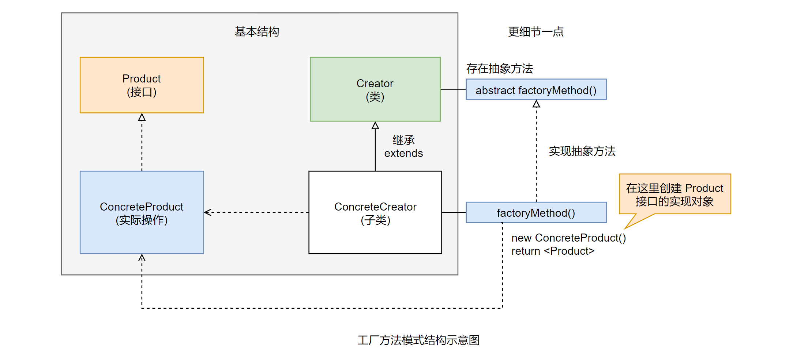

# 工厂方法模式 (Factory Method)

## 场景问题

### 导出数据的应用框架

考虑到这样一个实际应用：实现一个「导出数据的应用框架」，让客户「选择数据的导出方式」，并「正真执行数据导出」。

在一些实际的企业应用中，一个公司的系统往往分散在很多个不同的地方运行，比如各个分公司或者是门市点。公司「既没有建立全公司专有网络的实力」，但又「不愿意让业务数据实时地在广域网上传递」，一个是考虑数据安全的问题，另一个是运行速度的问题。

这种系统通常会又一个「折中的方案」，那就是各个分公司内运行系统的时候是「独立的」，是在自己分公司的「局域网内运行」。「每天业务结束的时候」，各个分公司会导出自己的业务数据，然后把业务数据打包，通过网络传输给总公司，或是专人把数据送到总公司，然后由总公司进行数据导入和核算。

通常这种系统在导出数据上会有一些「约定的方式」，比如导出成「文本格式、数据库备份形式、Excel 格式、XML 格式」等。

现在就来考虑实现这样一个应用框架。在继续之前，先来了解一些关于框架的知识。

### 框架的基础知识

#### 1. 框架是什么

简单点说，**框架就是能完成一定功能的「半成品软件」。** (完成一半任务，但不全部完成)

就其本质而言，框架是一个软件，而且是一个半成品软件。所谓半成品，就是「还不能完全实现」用户需要的功能。框架知识实现用户需要功能的「一部分」，还需要「进一步加工」，才能成为一个「满足用户需要的」、「完整的软件」。因此框架级的软件，它的「主要客户是开发人员，而不是最终用户」。

延伸：有些朋友会想，既然框架只是个半成品，那么何必要去学习和使用框架呢，学习成本也不算小？那就是因为框架能完成一定的功能，也就是 "框架已经完成的一定的功能" 在吸引着开发者，让大家去学习和使用框架。

#### 2. 框架能干什么

**能完成一定功能，加快应用开发速度。**

由于框架完成了一定的功能，而且通常是一些「基础的、有难度的、通用的」功能，这就「避免」我们在开发应用的时候「完全从头开始」，而是在框架已有的功能上继续开发，也就是说「会复用框架的功能」，从而「加快应用的开发进度」。

**给我们一个精良的程序架构。**

框架定义了应用的整体架构，包括「类和对象的分割」、「各部分的主要责任」、「类和对象怎么协作」，以及「控制流程」等。

Java 界流行的框架，大多出自「大师手笔」，「设计都很精良」。基于这样的框架来开发，一般会「遵循框架已经规划好的结构来进行开发」，从而使开发应用程序的「结构也相对变得精良了」。

评论：

- 框架完成一半的任务，但不全部完成。
- 开发者 → 框架 (半成品) -加工→ 最终用户
- 框架给我们提供一个固定的规范，开发者之间也能通过框架建立起沟通的桥梁。
- 框架提供一个完备的生命周期。
- 相当于大师引导你对代码进行布局，模块进行分割。

#### 3. 对框架的理解

**基于框架来开发，事情还是那些事情，只是看谁来做的问题。**

对于应用程序和框架的关系，可以用一个图来简单描述一下：


如果没有框架，那么客户要求的所有功能都由开发者自己来开发，没问题，「同样可以」实现用户需要的功能，只是开发人员的「工作多点」。

如果有了框架，框架本身完成了一定的功能，那么框架已有的功能开发人员就可以不做了，开发人员只需要完成框架没有的功能，最后同样是完成客户端要求的所有功能，但开发者的「工作就减少了」。(自己开发框架：高度自定义)

也就是说，基于框架来开发，软件要完成的功能并没有变化，还是客户要求的所有功能，也就是 “事情还是那些事情” 的意思。但是有了框架后，「框架完成了一部分功能」，然后开着再完成一部分功能，最后由「框架和开发人员合起来」完成了整个软件的功能，也就是「看这些功能 “由谁做” 的问题」。

**基于框架开发，可以「不去做框架所做的事情」，但是「应该明白框架在干什么」，以及「框架是如何实现相应功能的」。**

事实上，在实际开发中，应用程序和框架的关系「通常都不会像」上面讲述的那样，「分得那么清楚」，更多普遍的是「相互交互」的。也就是应用程序做一部分工作，框架做另一部分工作，然后应用程序再做一部分工作，框架再做另一部分工作。「如此交错」，最后由应用程序和框架组合起来完成用户的功能需求。

也用个示意图来说明，如图：


如果把这个由应用程序和框架「组合再一起构成」的矩形，当作最后完成的软件。试想一下，如果你「不懂框架」在干什么，相当于框架对你来讲「是个黑河」，也就是相当于在上图中去掉框架的两块，会发现什么？没错，剩下的应用程序是「支离破碎」的，是「相互分隔开来的」。


延伸：着会导致一个「非常致命」的问题，整个应用「是如何运转起来的」，你是「不清楚的」，也就是说对你而言，项目已经「失控」了，从项目管理的角度来讲，这是「很危险的」。

因此，在基于框架开发的时候，虽然「可以不去做框架所做的事情」，但是「应该搞明白框架在干什么」，如果「条件允许」的话，还应该搞清楚框架是「如何实现相应功能的」，「**至少应该把「大致的实现思路和实现步骤」搞清楚，这样我们才能整体地掌控整个项目，才能尽量减少出现「项目失控」的情况。**」

评论：

框架和开发是强交互的，这就是为什么需要明白框架内部工作原理的原因。(强交互 / 强关联 / 强耦合)

#### 4. 框架和设计模式的关系

**(1) 设计模式比框架「更抽象」**

框架已经是实现出来的软件了，虽然只是个「半成品的软件」，但毕竟是已经实现出来的了；而「设计模式」的「重心」还在于「**解决问题的方案上**」，也就是还「**停留在思想的层面上**」。因此设计模式比框架更为抽象。

**(2) 设计模式是比框架「更小的体系结构元素」**

如上所述，框架是已经实现出来的软件，并「实现了一系列的功能」，因此「一个框架通常会包含多个设计模式的应用」。

**(3) 框架比设计模式「更加特例化」**

框架是完成一定功能的「半成品软件」，也就是说，框架的目的很明确，就是要「解决某一个领域的某些问题」，那是具体的功能。「不同的领域实现出来的框架是不一样的」。

而设计模式还停留在「思想层面」，只要相应的问题适合用某个设计模式来解决，在不同的领域都可以应用。

因此，框架「总是针对特定领域的」，而设计模式「更加注重从思想上、方法上」来解决问题，「更加通用化」。

评论：

- 用「设计模式」来设计「框架」
- 很多特定的情况，运用不同的模式看哪个适合，特殊问题特殊考虑。换言之，某些东西只适合某些特定的设计，这样设计比较好用。就像前端、后端设计、MVC、MVVM、BS、SaaS、O2O、P2P 哈哈。

### 有何问题

分析上面要实现的应用框架，「不管用户选择什么样的导出格式」，最后「导出的都是一个文件」，而且「系统并不知道」究竟要导出成为「什么样的文件」，因此应该有一个「**统一的接口**」来「描述系统最后生成的对象」，并「操作输出的文件」。

先把导出的文件对象的接口定义出来。实例代码如下：

```java
/**
 * 导出的文件对象的接口
 */
public interface ExportFileApi {
    /**
     * 导出内容成为文件
     * @param data 示意：需要保存的数据
     * @return 是否导出成功
     */
    public boolean export(String data);
}
```

对于实现导出数据的「业务功能对象」，它应该「根据需要」来创建相应的 ExportFileApi 的实现对象，因为特定的 ExportFileApi 的「实现」是与具体的业务相关的。但是对于「实现导出数据的业务功能对象」而言，它「并不知道应该创建哪一个」ExportFileApi 的实例对象，「也不知道应该如何创建」。

也就是说：对于「实现」导出数据的业务功能对象，它需要「创建」ExportFileApi 的「具体实例对象」，但是它「只知道 ExportFileApi 接口」，而「不知道其具体的实现」，那该怎么办呢？

## 解决方案

### 使用工厂方法模式来解决问题

用来解决上述问题的一个合理的解决方案就是「工厂方法模式 (Factory Method)」。那么什么是工厂方法模式呢？

#### 1. 工厂方法模式的定义

> 定义一个「用于创建对象的接口」，让「子类决定」实例化哪一个类，「Factory Method」使一个类的实例化「延迟到」其「子类」。

注意：延迟执行的思想，延迟到「其子类」。

#### 2. 应用工厂模式来解决问题的思路

仔细分析上面的问题，事实上「在实现导出数据的业务功能对象里面」，根本就「不知道究竟要使用哪一种」导出文件的格式，因此这个对象根本就「不应该」和「具体的导出文件的对象」「耦合在一起」，它只需要「面向导出的文件对象接口」就可以了。

评论：为了实现解耦合，中间插入一层，这一层可以塞很多相同的 interface (Product) 的「实现」。

这不就自相矛盾了吗？「要求面向接口，不让和具体的实现耦合」，但「又需要创建接口的“具体实现对象”的实例」。这么解决这个矛盾啦？

**工厂方法模式的解决思路很有意思，那就是「不解决」，采用「无为而治」的方式**；不是需要「接口对象」吗，那就「定义一个方法」来创建；可是事实上它「自己是不知道如何创建」这个接口对象的 (自己不知道，但用子类创建)，没有关系，定义成「抽象**方法**」就可以了，自己实现不了，那就让「子类」来实现，这样「这个对象本身」就可以是「面向接口编程」，而「无需关心到底如何创建接口对象」了。


### 工厂方法模式的结构和说明



