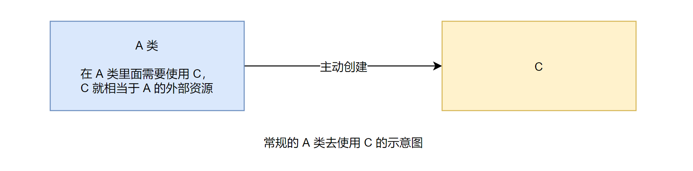
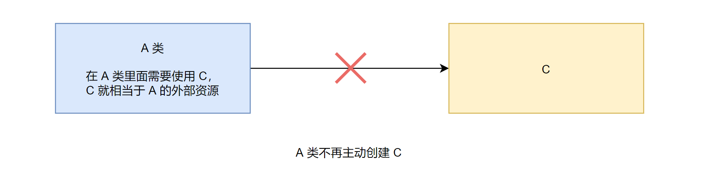
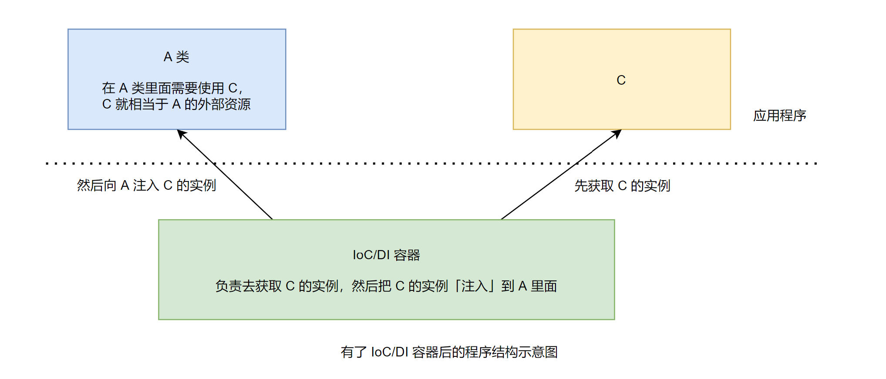
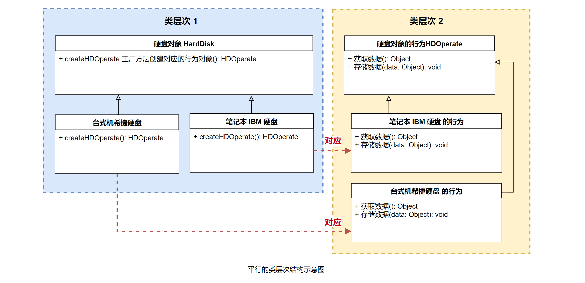

### 工厂方法模式与 IoC/DI

- IoC —— Inversion of Control，控制反转。
- DI —— Dependency Injection，依赖注入。

#### 1. 如何理解 IoC/DI

想要理解上面两个概念，就必须搞清楚如下的问题：

- 参与者都有谁？
- 依赖：谁依赖于谁？为什么需要依赖？
- 注入：谁注入于谁？到底注入什么？
- 控制反转：谁控制谁？控制什么？为什么叫反转 (有反转就应该有正转了)？
- 依赖注入和控制反转是同一概念吗？

下面就来简单地回答一下上述问题，把这些问题搞明白了，也就明白 IoC/DI 了。

- (1) 参与者都有谁：一般有「三方参与者」，一个是「某个对象」；另一个是「IoC/DI」的容器；还有一个是「某个对象的外部资源」。

  解释：解释一下名词，某个对象指的就是任意的、普通的 Java 对象，IoC/DI 的「容器」简单点说就是指用来实现 IoC/DI 功能的一个「框架程序」；对象的「外部资源」就是「对象需要的」，但是「是从对象外部获取的」，都「统称为资源」，比如，对象需要的其他对象，或者是对象「需要的文件资源」等。

- (2) 谁依赖于谁：当然是某个「对象」依赖于 IoC/DI 的容器。
- (3) 为什么需要依赖：对象「需要 IoC/DI 的容器」来「提供对象的外部资源」。
- (4) 谁注入于谁：很明显是 IoC/DI 的容器注入某个对象。
- (5) 到底注入什么：就是注入某个对象「所需要的外部资源」。
- (6) 谁控制谁：当然是「IoC/DI 的容器」来控制对象了。
- (7) 控制什么：主要是控制对象实例的「创建」。
- (8) **为何叫反转**：反转是「相对于正向」而言的，那么什么算是正向呢？考虑一下常规情况下的应用程序，如果要「在 A 里面使用 C」，你会怎么做呢？当然是直接去创建 C 的对象，也就是说，在 A 类中「主动」去获取所需要的外部资源 C，这种情况「被称为正向的」。那么什么是「反转」呢？就是在 A 类「不再主动」去获取 C，而是「被动等待」，「等待 IoC/DI 的容器」获取一个 C 的实例，然后「反向地注入」到 A 类中。

用图例来说明一下。

先看没有 IoC/DI 的时候，常规的 A 类使用 C 的示意图，如图所示：



当有了 IoC/DI 容器后，A 类「不再主动去创建 C 了」，如图：



而是「被动等待」，等待 IoC/DI 的容器获取一个 C 的实例，然后「反向地注入到 A 类中」，如图：



- (9) 依赖注入和控制反转是同一概念吗？
  
  根据上面的讲述，应该能看出来，依赖注入和控制反转是「对同一件事情的不同描述」。从某个方面讲，就是它们「描述的角度不同」。依赖注入是从「应用程序角度」去描述的，可以把依赖注入描述得完整点：**应用程序依赖容器创建注入它所需要的外部资源**；而控制反转是从「容器的角度」去描述，描述得完整点就是：**容器控制应用程序，由容器「反向地」向应用程序「注入」其所需要的外部资源**。

  小结：其实 IoC/DI 对编程带来的最大改变「不是在代码上，而是在思想上」，发生了「主从换位」的变化。应用程序「原本是老大」，要获取什么资源都是「主动出击」，现在 IoC/DI 的思想中，应用程序就变得被动了，被动地等待 IoC/DI 容器来创建并注入它需要的资源了。

  这么小小的一个改变其实是「编程思想的一个大进步」，这样就「有效地分离了**对象**和**它所需要的外部资源**」，使得它们「松散解耦」，有利于「功能复用」，更重要的是使得整个程序的「整个体系结构变得非常灵活」。

  评论：依赖注入和控制反转是对一件事情的不同描述，描述的角度不同，前者应用程序角度，后者容器的角度；这种思想让对象与其需要的外部资源之间「松散解耦」，使得整个体系更加灵活；例如一个模块，由于松散解耦了，所以可以单独拿出来使用，方便集成测试之类的。

#### 2. 工厂方法模式和 IoC/DI 的关系

从某个角度讲，工厂方法模式和 IoC/DI 的思想很类似。

评论：多出来个第三者 (例如：IoC/DI 容器)，把某些事情交给第三者来做，实现原来两者之间的「松散解耦」，让整个体系结构变得灵活，两者不再像原来一样紧密联系。

上面讲了，有了 IoC/DI 后，应用程序就「不再主动」了，而是「被动地等待」由容器来注入资源。那么在编写代码的时候，一旦要用到外部资源，就会「开一个窗口」，让容器能注入进来，也就是「提供给容器一个注入的途径」，当然这不是我们的重点，就不去细细讲解了，用 setter 注入来示例一下，使用 IoC/DI 的示例代码如下：

```java
public class A {
  /**
   * 等待被注入进来
   */
  private C c = null;

  /**
   * 注入资源 C 的方法
   * @param c 被注入的资源
   */
  public void setC(C c) {
    this.c = c;
  }

  public void t1() {
    // 这里需要使用 C，可是又不让主动去创建 C 了，怎么办？
    // 反正就要求「从外部注入」，这样更省心
    // 自己不用管怎么获取 C，直接使用就好了
    c.tc();
  }
}
```

接口 C 的示例代码如下：

```java
public interface C {
  public void tc();
}
```

从上面的示例代码可以看出，现在 A 里面写代码的时候，凡是碰到了需要外部资源，那么就「提供注入的途径」，要求「从外部注入」，自己「只管使用这些对象」。

再来看看「工厂方法模式」，如何实现上面同样的功能。为了区分，分别取名为 A1 和 C1。这个时候在 A1 里面要使用 C1 对象，也不是由 A1 主动去获取 C1 对象，而是「创建一个工厂方法」，类似于「一个注入的途径」；然后由子类，假设叫 A2 吧，由 A2 来获取 C1 对象，在调用的时候，替换掉 A1 的相应方法，相当于「反向注入回到 A1 里面」。示例代码如下：

```java
public abstract class A1 {
  /**
   * 工厂方法，创建 C1，类似于从子类注入进来的途径
   * @return C1 的对象实例
   */
  protected abstract C1 createC1();

  public void t1() {
    // 这里需要使用 C1 类，可是不知道究竟是用哪一个
    // 也就不主动去创建 C1 了，怎么办？
    // 反正会在子类里面，这里不用管怎么获取 C1，直接使用就好了
    createC1().to();
  }
}
```

子类示例代码如下：

```java
public class A2 extends A1 {
  protected C1 createC1() {
    // 真正的选择具体的实现，并创建对象
    return new C2();
  }
}
```

C1 接口和前面的 C 接口是一样的，C2 这个实现类也是空的，只是演示一下，因此就不去展示它们的代码了。

提示：仔细体会上面的示例，对比它们的实现，尤其是从思想层面上，会发现工厂方法模式和 IoC/DI 的思想是相似的，都是「主动变被动」，进行了「主从换位」，从而获得了「更灵活」的程序结构。

评论：工厂方法模式和 IoC/DI 的思想类似，工厂方法父类提供一个 abstract createC1 方法，子类去实现这个 createC1 方法，也就相当于：父类提供了一个「注入的途径 / 窗口」；子类向父类「反向注入」创建后的对象，父类只管使用它，这样就实现了「主从换位」，获得更灵活的程序结构。父类不管你子类怎么创建，反正只要东西是我想要的就行，子类这边就可以使用「各种方法」创建父类需要的东西，十分灵活。

### 平行的类层次结构

#### 1. 平行的类层次结构的含义

简单点说，假如有「两个」类层次结构，「**其中一个类层次中的每个类**在**另一个类层次中**都有**一个<u>对应的</u>类的结构**」，就被称为「平行的**类**层次结构」。

举个例子来说，硬盘对象有很多种，如分成「台式机硬盘」和「笔记本硬盘」，在台式机硬盘的「具体实现」上面，又有「希捷、西数等」不同的品牌的实现，同样在笔记本硬盘上，也有「希捷、日立、IBM 等」不同品牌的实现；硬盘对象「具有自己的行为」，如硬盘能存储数据，也能从硬盘上获取数据，不同的硬盘对象对应的「行为对象是不一样的」，因为不同的硬盘对象，它的「行为的实现方式」是不一样的。如果把「硬盘对象」和「硬盘对象的行为」分开描述，那么就构成了如图所示的结构：



「硬盘对象」是一个类层次，「硬盘的行为」也是一个类层次，而且「两个层次中的类」是「对应的」。台式机希捷「硬盘对象」就对应着「硬盘行为」里面的台式机希捷硬盘的行为；笔记本 IBM 硬盘就对应着笔记本 IBM 硬盘的行为，这就是一种「典型的平行的类层次结构」。

「**标星**」这种平行的类层次结构用来干什么？主要用来：把一个层次中的「某些行为」分离出来，让层次中的类把「原本属于自己的责任」，「委托给分离出来的类」去实现，从而使得「类层次本身变得简单」，「更容易扩展和复用」。

一般来讲，分离出去的这些类的「行为」，会「对应着」类层次结构来组织，从而「形成一个新的类层次结构」，相当于原来对象的类层次结构，而这个层次结构和原来的类层次结构是「存在对应关系的」，因此被称为「平行的类层次结构」。

#### 2. 工厂方法模式和平行的类层次结构的关系

可以使用「工厂方法模式」来「连接平行的类层次」。

如刚刚的图所示，在每个硬盘对象里面，都有一个「工厂方法」createHDOperate，通过这个「工厂方法」，客户端可以获取一个和「硬盘对象相对应的行为对象」。在硬盘对象的「子类」里面，会「覆盖父类的工厂方法 createHDOperate」，以「提供与**自身对应**的行为对象」，从而「自然地」把两个平行的类层次「连接起来使用」。

### 参数化工厂方法

所谓的参数化工厂方法指的就是：通过给工厂方法「传递参数」，让工厂方法根据参数的不同来「创建不同的产品对象」，这种情况就被称为「参数化工厂方法」。当然工厂方法创建的「不同产品」必须是「同一个 Product 类型」。

来改造前面的示例，现在「由一个工厂方法」来「创建 ExportFileApi 这个产品对象」，但是 ExportFileApi 接口的实现很多，为了「方便创建的选择」，直接「从客户端传入一个参数」，这样在需要创建 ExportFileApi 对象的时候，就把这个「参数传递给」工厂方法，让工厂方法来实例化具体的 ExportFileApi 实现对象。

还是看看代码示例会比较清楚。

(1) 先来看看 Product 接口，就是 ExportFileApi 接口，和前面的示例相比没有任何变化，只是为了方便大家查看，这里重复一下。示例代码如下：

```java
/**
 * 导出的文件对象的接口
 */
public interface ExportFileApi {
  /**
   * 导出内容成为文件
   * @param data 示意：需要保存的数据
   * @return 是否导出成功
   */
  public boolean export(String data);
}
```

(2) 同样提供「保存成文本文件」和「保存成数据库备份文件」的实现，和前面的示例相比没有任何变化。示例代码如下：

```java
public class ExportTxtFile implements ExportFileApi {
  public boolean export(String data) {
    // 简单地示意一下，这里需要操作文件
    System.out.println("导出数据"+data+"到文本文件");
    return true;
  }
}

public class ExportDB implements ExportFileApi {
  public boolean export(String data) {
    // 简单示意一下，这里需要操作数据库和文件
    System.out.println("导出数据"+data+"到数据库备份文件");
    return true;
  }
}
```

(3) 接下来该看看 ExportOperate 类了，这个类的变化大致如下。

- ExportOperate 类中的创建产品的「工厂方法」，通常需要「提供默认的实现」，「不再抽象了」，也就是变成了「正常方法」。
- ExportOperate 类也「不再定义成抽象类」了，因为「有了默认的实现」，客户端可能需要「直接使用这个对象」。
- 设置一个导出类型的参数，通过 export 方法从客户端传入。

评论：只用一个~~子类~~ (现在子类也不用了，所以 class 不设置成 abstract 了) 实现之前两个 operate 的任务。

看看代码吧，示例代码如下：

```java
/**
 * 实现导出数据的业务功能对象
 */
public class ExportOperate { // ← 不再是抽象类了
  /**
   * 导出文件
   * @param type 用户选择的导出类型
   * @param data 需要保存的数据
   * @return 是否成功导出文件
   */
  public boolean export(int type, String data) { // ← 传入参数
    // 使用工厂方法
    ExportFileApi api = factoryMethod(type);
    return api.export(data);
  }

  /**
   * 工厂方法，创建导出的文件对象的接口对象
   * @param type 用户选择的导出类型
   * @return 导出的文件对象的接口对象
   */
  protected ExportFileApi factoryMethod(int type) {
    // ↑ 不再抽象了，要提供默认的实现，根据传入的导出类型来选择已有的实现

    ExportFileApi api = null;
    // 根据类型来选择究竟要创建哪一种导出文件对象
    if (type == 1) {
      api = new ExportTxtFile();
    } else if (type == 2) {
      api = new ExportDB();
    }

    return api;
  }
}
```

(4) 此时的客户端非常简单，直接使用 ExportOperate 类。示例代码如下：

```java
public class Client {
  public static void main(String[] args) {
    // 创建需要使用的 Creator 对象
    ExportOperate operate = new ExportOperate();
    // 调用输出数据的功能方法，传入选择导出的参数
    operate.export(1, "测试数据");
  }
}
```

测试看看，然后修改一下客户端的参数，体会一下通过参数来选择具体的导出实现的过程。

提示：这是一种「很常见的参数化工厂方法」的实现方式，但是「也还是有把参数化工厂方法实现为抽象的」，这点要注意，「并不是说参数化工厂方法就不能实现为抽象类了」。只是一般情况下，参数化工厂，「在父类就会会提供默认的实现」。

(5) 扩展新的实现。

使用参数化工厂方法，「扩展起来会非常容易」，已有的代码都不会改变，只需要「新加入一个子类来提供新的工厂方法实现」，然后在客户端使用这个新的子类即可。

这种实现方式还有一个很有意思的功能，就是「子类可以选择覆盖」，不想覆盖的功能还可以「返回去让父类来实现」，很有意思。

扩展一个导出成 xml 文件的示例代码如下：

```java
/**
 * 导出成 xml 文件的对象
 */
public class ExportXml implements ExportFileApi {
  public boolean export(String data) {
    // 简单示意一下
    System.ot.println("导出数据"+data+"到 XML 文件");
    return true;
  }
}
```

然后扩展 ExportOperate 类，来加入新的实现。示例代码如下：

```java
/**
 * 扩展 ExportOperate 对象，加入可以导出的 XML 文件
 */
public class ExportOperate2 extends ExportOperate {
  /**
   * 覆盖父类的工厂方法，创建导出的文件对象的接口对象
   * @param type 用户选择的导出类型
   * @return 导出的文件对象的接口对象
   */
  protected ExportFileApi factoryMethod(int type) {
    ExportFileApi api = null;
    // 可以全部覆盖，也可以选择自己感兴趣的覆盖
    // 这里只想添加自己新的实现，其他的不管
    if (type == 3) {
      api = new ExportXml();
    } else {
      // 其他的还是让父类来实现
      api = super.factoryMethod(type);
    }
    return api;
  }
}
```

看看此时的客户端，也非常简单，只是在变换传入的参数。示例代码如下：

```java
public class Client {
  public static void main(String[] args) {
    // 创建需要使用的 Creator 对象
    ExportOperate operate = new ExportOperate2();

    // 下面变换传入的参数来测试参数化工厂方法
    operate.export(1, "Test1");
    operate.export(2, "Test2");
    operate.export(3, "Test3");
  }
}
```

对应的测试结果如下：

```
导出数据Test1到文本文件
导出数据Test2到数据库备份文件
导出数据Test3到XML文件
```

通过上面的示例，好好体会一下参数化工厂方法的实现和带来的好处。

### 工厂方法模式的优缺点

#### 工厂方法模式的优点

工厂方法模式的优点

- 可以在「不知道具体实现的情况下」编程

  工厂方法模式可以让你实现功能的时候，如果「需要某个产品对象」，只需要「使用产品的接口」即可，而「无需关心具体的实现」。选择具体实现的任务「延迟到子类去完成」。(IoC/DI 思想)

- 更容易「扩展对象的新版本」

  工厂方法给子类提供了一个「挂钩」，使得「扩展新的对象变得非常容易」。比如上面示例的参数化工厂方法的实现种，扩展一个新的导出 XML 文件格式的实现，「已有的代码都不会改变」，只要「新加入一个子类」提供新工厂方法实现，然后在客户端使用这个新的子类即可。

  提示：另外这里提到的挂钩，就是我们经常说的「钩子方法 (Hook)」，这个会在后面讲「模板方法模式」的时候详细点说明。

- 连接「平行的类层次」

  工厂方法除了创造产品对象外，在「连接平行的类层次」上也大显身手。这个在前面已经详细讲述了。

#### 工厂方法模式的缺点

- 「具体产品对象」和「工厂方法」的耦合性

  在工厂方法模式中，工厂方法是「需要创建产品对象的」，也就是需要「选择具体的产品对象」，并「创建它们的示例」，因此「具体产品对象和工厂方法是耦合的」。

### 思考工厂方法模式

#### 1. 工厂方法模式的本质

> 工厂方法模式的本质：延迟到子类来选择实现。

仔细体会前面的示例，你会发现，工厂方法模式中的「工厂方法」，在具体的实现的时候，一般是先「选择具体使用哪一个具体的产品实现对象」，然后「创建这个具体产品对象的实例」，最后就可以返回出去了。也就是说，工厂方法「本身并不会去实现产品接口」，具体的产品实现是「已经写好」的，工厂方法「只要去选择实现就好了」。

有些朋友可能会说，这个不是跟简单工厂一样吗？

从本质上讲，它们确实是「非常类似的」，在具体实现上都是「选择实现」。但是也「存在不同点」，简单工厂是「直接在工厂类里面进行 “选择实现”」；而工厂方法会把这个工作「延迟到子类来实现」，工厂类里面「使用工厂方法的地方」是「依赖于抽象而不是具体的实现」，从而使得系统更加灵活，「具有更好的可维护和可扩展性」。

其实如果把工厂模式的 Creator 退化一下，只提供工厂方法，而且这些方法还都提供默认的实现，那不就变成简单工厂了吗？比如把刚才示范参数化工厂方法的例子代码拿过来再简化一下，你就能看出来，写得跟简单工厂是差不多的。实例代码如下：

```java
/**
 * 实现导出数据的业务功能对象
 */
public class ExportOperate {

// ↓↓↓ 简化这个 Creator，把这些都注释 ↓↓↓
//  /**
//   * 导出文件
//   * @param type 用户选择的导出类型
//   * @param data 需要保存的数据
//   * @return 是否成功导出文件
//   */
//  public boolean export(int type, String data) {
//    // 使用工厂方法
//    ExportFileApi api = factoryMethod(type);
//    return api.export(data);
//  }

  /**
   * 工厂方法，创建导出的文件对象的接口对象
   * @param type 用户选择的导出类型
   * @return 导出的文件对象的接口对象
   */

  // ↓ 留下的这个方法，如果把它修改成 public static 的，
  // ↓ 是不是就和简单工厂写得一样了？
  protected ExportFileApi factoryMethod(int type) {
    ExportFileApi api = null;
    // 根据类型来选择究竟要创建哪一种导出文件对象
    if (type == 1) {
      api = new ExportTxtFile();
    } else if (type == 2) {
      api = new ExportDB();
    }

    return api;
  }
}
```

看完上述代码，会体会到简单工厂和工厂方法模式是「有很大的相似」的了吧。从某个角度来讲，可以认为简单工厂就是工厂方法模式的「一种特例」，因此它们的本质是类似的，也就不足为奇了。

#### 2. 对设计原则的实现

工厂方法模式很好地体现了「依赖倒置原则」。

依赖倒置原则告诉我们「要依赖抽象，不要依赖于具体类」，简单点说就是：「不能让高层组件依赖于低层组件」，而且不管高层组件还是底层组件，都应该「依赖于抽象」。

比如前面的示例，实现客户端请求操作的 ExportOperate 就是「高层组件」；而「具体实现数据导出的对象」就是底层组件，比如 ExportTxtFile、ExportDB；而 ExportFileApi 接口就相当于是那个抽象。

对于 ExportOperate 来说，它「不关心具体的实现方式」，它只是「面向接口编程」；对于具体的实现来说，它只关心「如何实现接口所要求的功能」。

那么「倒置的是什么呢」？倒置的是这个接口的「所有权」。事实上，ExportFileApi 接口中定义的功能，都是由高层组件 ExportOperate 来提出的要求，也就是说接口中的功能，是高层组件需要的功能。但是高层组件「只是提出要求」，并不关系如何实现，而底层组件，就是来真正实现高层组件所要求的接口功能的。因此看来，底层实现的接口的所有权并不在底层组件手中，而是「倒置到高层组件去了」。(高层组件牵制着底层组件)

#### 3. 何时选用工厂方法模式

建议在以下情况中选择工厂方法模式。

- 如果一个类「需要创建某个接口的对象」，但是又「不知道具体的实现」，这种情况可以选用工厂方法模式，把创建对象的工作「延迟到子类中」去实现。
- 如果一个类「本身就希望由它的子类来创建」所需的对象的时候，应该使用工厂方法模式。

### 相关模式

- 工厂方法模式和抽象工厂模式
  
  这两个模式可以「组合使用」，具体的放到抽象工厂模式中去讲。

- 工厂方法模式和模板方法模式

  这两个模式外观类似，都有一个「抽象类」，然后由「子类」来提供一些实现，但是工厂方法模式的子类「专注的是创建产品对象」，而模板方法模式的子类「专注的是为了固定的算法骨架提供某些步骤的实现」。

  这两个模式可以「组合使用」，通常在「模板方法模式里面」，使用工厂方法来「创建模板方法需要的对象」。
